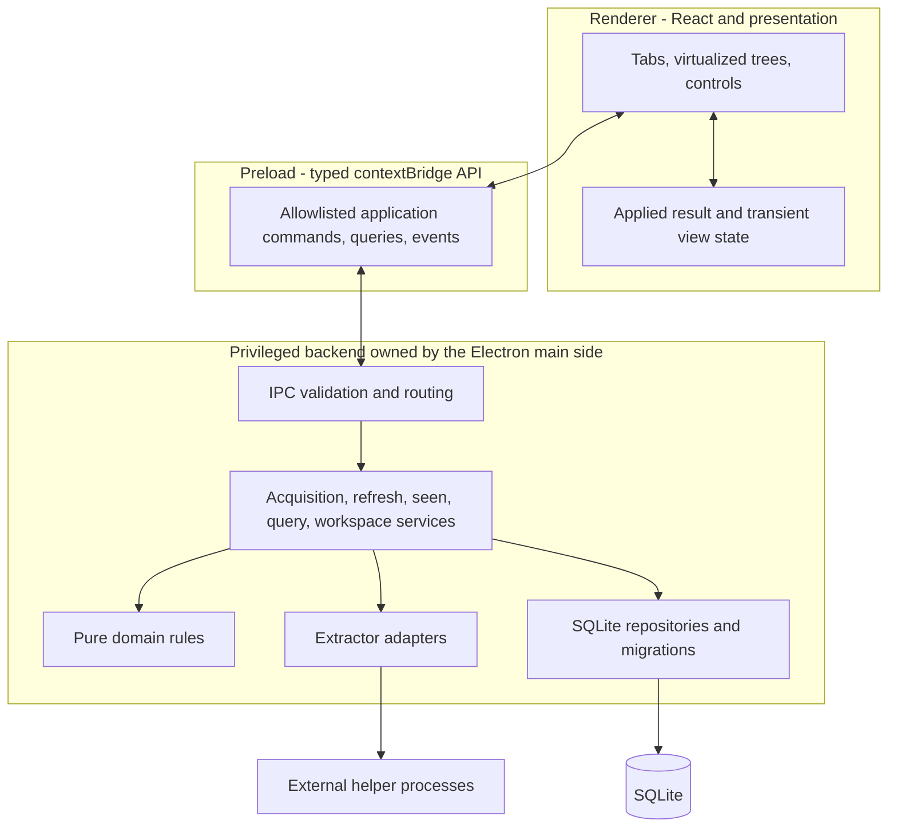

# Architecture

Status: target architecture, with proposed organization explicitly identified. [Map](README.md) · [Requirements](PRODUCT_REQUIREMENTS.md) · [Owner's walkthrough](HOW_IT_WORKS.md) · [Decisions](decisions/README.md)

## Current scaffold

The repository uses Electron Forge/Vite and strict TypeScript. [src/main.ts](../src/main.ts) creates a sandboxed, context-isolated window with Node integration disabled; navigation/new windows are blocked. [src/preload.ts](../src/preload.ts) exposes the narrow `window.reader` API. [src/renderer.tsx](../src/renderer.tsx) mounts the React reader, with components and localization in `src/renderer`, pure domain rules in `src/domain`, and explicitly synthetic fixtures used for main-side initialization.

The persistence milestone adds `src/main/persistence` for SQLite profiles/migrations/repository mapping, `src/main/reader-service.ts` for validated use cases and structured outcomes, `src/main/reader-ipc.ts` for channel/sender routing, `src/shared` for driver-free contracts/preferences, and `src/preload/reader-bridge.ts` for the private transport wrapper. One main-owned built-in SQLite connection stores normalized discussions, separate per-comment local state, and preferences. The renderer loads asynchronously and updates only after save acknowledgment; it has no fixture-state fallback. Ctrl subtree changes are transactional and preserve displayed order. [ADR 0002](decisions/0002-sqlite-and-typed-reader-boundary.md) records these choices; [ADR 0001](decisions/0001-synthetic-reader-foundation.md) remains the foundation record. ADR 0004 adds pure normalized merge planning and transactional SQLite ingestion/history. [ADR 0005](decisions/0005-live-helper-execution-and-acquisition-ipc.md) adds main-only live public acquisition/refresh and minimal UI. Queries/filtering and virtualization remain absent. The broader target below is not a completed security review. See [Testing](TESTING.md).

Initial development and packaging target Windows. Platform integrations should avoid unnecessary barriers to later Linux/macOS support, but those platforms are not initial implementation or packaging requirements.

## Live acquisition implementation

[ADR 0006](decisions/0006-compact-reader-and-persistent-tabs.md) adds separate
SQLite workspace tables and exact open/activate/close intents. ReaderState contains
library data plus a compact ordered workspace DTO. Tab writes return workspace
only and never mutate discussion/seen/history. Successful Acquire opens within the
merge transaction; Refresh preserves workspace. A persisted workspace revision
lets React reject older acknowledgments independently of seen reconciliation.
Only tab IDs/order/active ID restore; view scroll/filter/expansion remain future.

Author avatar evidence flows adapter → normalized remote JSON → source-independent
Author → decorative anonymous HTTPS image/fallback. Older JSON defaults missing
avatar evidence to unavailable in memory. CSP permits HTTPS images without relaxing
script/process access. Main snapshots exact executable overrides before direct PATH
lookup; values and paths never cross preload. See [Extractors](EXTRACTORS.md).

`acquisition-target.ts` owns supported URL validation/canonicalization;
`helper-process.ts` owns startup override/direct PATH lookup and no-shell asynchronous spawning;
`live-extraction.ts` probes pinned versions, builds trusted commands, owns anonymous
Community temporary config/output, enforces deadlines and normalizes before writes.
`acquisition-service.ts` coordinates the temporary single-live-operation lock,
stored-identity refresh, repository ingestion and compact acknowledgment.
`ReaderService` validates exact intent payloads. The IPC sender/frame/document
checks are unchanged. Raw output, paths, environment and process capability never
cross preload. Normal quit aborts/awaits child cleanup before closing SQLite.

Successful acquire/refresh returns committed ReaderState plus item/coverage/count
summary. Existing seen state is never written by merge, including edits made
while extraction runs. Structured fixed diagnostic tokens enter existing attempt
history; full stderr/public payloads do not. See ADR 0005 for the Windows process
tree termination and unresolved release work; ADR 0006 extends helper resolution
with exact startup overrides.

## Required process boundary

The privilege boundary is renderer -> typed preload/contextBridge API -> privileged application backend owned by the Electron main side -> persistence/extractors. The renderer never directly owns or accesses SQLite and receives no generic Node, filesystem, SQL, shell, or process-launch capability. The main-side backend may later delegate database work to an internal worker if justified; that is an implementation decision within the same privilege boundary. Extractor processes are invoked only by Electron main. Backend output is untrusted data, not executable UI content.

Implemented IPC maintains context isolation and disabled renderer Node integration, validates exact payload shapes/arity and allowed senders, and exposes bootstrap, manual seen changes, preferences, acquire({url}), refresh({itemId}), openStoredItem({itemId}), activateTab({itemId}) and closeTab({itemId}). Only the owning window's top-level expected document is accepted. TypeScript does not replace runtime validation. Stable error codes support localized failure context; broader request-ID/diagnostic policy remains future work.

The bridge should express intent such as opening an item, querying comments, setting seen state for a validated scope, refreshing, or persisting tab preferences. These are conceptual operations, not finalized method signatures. Main resolves and validates identities, scope, executable selection, and arguments. Do not expose a generic `execute(command)`, `query(sql)`, or unrestricted IPC forwarding API. Permalink opening and copy actions also use appropriately constrained application capabilities. Detailed sandbox/CSP/navigation policy and API contracts must be finalized with the relevant implementation increment.

## Responsibilities and dependency direction

| Layer | Owns | Must not depend on |
| --- | --- | --- |
| Domain | Comment identity and trees; match predicates; state mutation rules; merge planning; sort invariants | Electron, React, raw extractor schemas, SQL mechanics |
| Application services | Use cases, transaction boundaries, orchestration, cancellation/error outcomes, query and mutation scopes | React component lifecycle or rendered DOM |
| Extractor adapters | Helper invocation configuration, raw parsing, validation, normalization, capability/completeness reporting | Renderer or UI state |
| Persistence | SQLite access, schema evolution, repositories, history, backup/restore support | React or helper-specific comment models |
| IPC/preload | Serialized contracts, validation, narrow capability exposure | Arbitrary renderer-supplied executable paths or SQL |
| Renderer | Accessible reading interactions, virtualization, per-tab view state, presentation, localization and themes | Raw helper formats, direct database/process/filesystem access |

The data flow is external extractor -> adapter/normalizer -> domain observations -> persistence -> UI. Domain rules use [our model](DOMAIN_MODEL.md). The persistence schema is a storage choice, and IPC DTOs are serialization choices; neither should force helper-specific fields into that model. See [Extractors](EXTRACTORS.md) and [Database](DATABASE.md).

One proposed future organization is `src/domain`, `src/main/services`, `src/main/extractors`, `src/main/persistence`, `src/shared` for serialized contracts, `src/preload`, and `src/renderer`. This is an illustration, not a required refactor of the current entry points. Exact modules and libraries should be selected incrementally and recorded in [ADRs](decisions/README.md) when significant.

## Four different kinds of state

| State | Examples | Ownership and lifetime |
| --- | --- | --- |
| Remote observations | Text, author metadata, parent relationships, publication time, likes | Normalized by adapters and persisted; eligible fields may update with newer valid information |
| Local user state | Each comment's seen flag | SQLite; never overwritten by a remote refresh |
| Discovery/history | First discovered, last observed, baseline acquisition, refresh outcomes, per-refresh additions | SQLite; independent of user processing state; initial baseline is not visually NEW |
| View/workspace state | Tabs, predicates, sort, expansion, selection, scroll, applied result membership | Renderer presentation with useful durable preferences in SQLite; exact pending-result restoration policy remains open |

This separation prevents a common destructive shortcut: replacing a database row with a raw helper object and accidentally resetting local fields. It also explains why Apply can change a view without saving any checkbox edits: those edits were already saved. See [Seen state](SEEN_STATE.md), [Refresh and merge](REFRESH_AND_MERGE.md), and [Filtering](FILTERING_AND_SEARCH.md).

## Reads, writes, and consistency

The initial query path evaluates all locally stored comments of the active discussion, including collapsed and unrendered comments. Raw search matches satisfy search alone; active-filter matches satisfy the complete filter set at the applied evaluation. Context expansion includes complete trees containing active-filter matches. Query results preserve this distinction for counts, bulk targeting, and navigation independently of mounted rows. Library-wide search is future scope. SQL may accelerate predicates; semantics remain the contract. Search execution location, indexes, worker use, and query batching remain implementation choices.

Seen mutations are explicit application commands with a validated target scope. Generic all/date bulk actions target the active discussion; matching bulk actions target the last applied active-filter matching IDs, including while seen edits await Apply. Successful writes persist immediately without silently rebuilding the applied matching set or displayed membership/order. Failures require visible feedback or rollback of optimistic presentation. The view must not misrepresent failed writes as saved. [Seen state](SEEN_STATE.md) defines subtree, bulk, and recoverability semantics without prescribing an undo mechanism.

The applied active-filter set is the authority for matching counts, match/context roles, matching bulk actions, and filtered-reader next/previous match navigation. Seen changes update live checkbox state but do not replace that set. Apply recomputes it locally. Exact pending-view styling and any separate live indicators remain UI choices; they must not redefine the applied matching set.

The implemented refresh pipeline stages and validates observations before a short merge transaction. Existing records retain local state; newly discovered identities get unseen defaults. Eligible remote fields may update with newer valid information, without requiring every run to mutate them. Missing records remain untouched. Refresh bookkeeping and content updates must describe the same committed outcome. After a successful explicit remote Refresh safely merges, automatically recompute the active view so newly discovered comments can appear under its filters. Apply remains local recomputation only. [ADR 0003](decisions/0003-extractor-observations-and-normalization.md) implements pure observation adapters and accepts valid partial/unknown input; [ADR 0004](decisions/0004-durable-observation-merge.md) implements durable normalized merges with baseline/history and safe relationship projection. ADR 0005 connects main-owned resolution/probes/process execution to those adapters, ingestion and acknowledged UI updates.

The first successful acquisition establishes a recorded baseline: comments receive `firstDiscoveredAt` and unseen defaults without visual NEW markers. Subsequent refresh discoveries are eligible for NEW independently of `publishedAt` and current seen state. Accepted partial/unknown acquisitions establish the first baseline with true coverage retained. Exact NEW marker lifetime remains unresolved. Publication filters use `publishedAt`; discovery-based "new since refresh" uses refresh history.

Concurrency must preserve these invariants: a checkbox changed while a helper runs cannot be replaced with an older captured value at commit; stale view results cannot overwrite newer workspace settings; overlapping refreshes cannot produce contradictory histories. Per-item serialization and revision-tagged query results are candidate techniques. ADR 0005 currently serializes live acquisition globally and leaves local writes available during helper awaits. The final scheduling/cancellation strategy and cross-tab view notification behavior remain open. State shared by tabs is still one set of stored comment records.

## Performance without DOM-dependent logic

Thousands to tens of thousands of comments are an expected workload, not an exceptional case. Virtualize the comment view, including variable-height content and expanded replies. Build traversal/navigation and overview marker information from the data model. Whole-tree inclusion in a query does not require mounting that whole tree as HTML simultaneously.

Persisted IDs should support scroll anchors and selection so recomputing or rendering rows does not confuse a comment's identity with its row index. Keep replies attached to their parents when sorting top-level threads. The overview/navigation ruler is a required target feature, using data for at least unseen, search-match, and subsequent-discovery markers; geometry and category overlap remain open. Main orchestration and renderer interaction must remain responsive while extraction, normalization, search, or SQLite work occurs. Batching and internal database workers can be evaluated within the main-owned backend without giving the renderer privileged access.

Regex execution needs a responsiveness strategy as well as syntax validation; pathological valid patterns must not freeze the application. Engine, execution budget, cancellation, limits, and user messaging are unresolved. Benchmark fixtures should exercise large deep/wide trees, long comments, broad and selective filters, and navigation to unmounted results. Specific latency budgets and libraries are not fixed. See [Filtering](FILTERING_AND_SEARCH.md) and [Testing](TESTING.md).

## Cross-cutting contracts

- **Language and appearance:** shared error codes and stable translation keys allow English/Polish presentation without tying domain behavior to interface language. Semantic tokens provide System/Light/Dark appearance, defaulting to System and following OS changes in that mode. [Localization and theming](LOCALIZATION_AND_THEMING.md)
- **User data:** SQLite is valuable persistent data. Environment isolation, migrations, backups, restoration, and eventual export must be designed before shipping those capabilities. [Database](DATABASE.md)
- **Distribution:** development PATH resolution must permit later app-local helpers. Windows is the initial target; supported Windows versions/architectures, native integration, and helper distribution/update mechanics remain open. Linux/macOS support may follow later. [Packaging](PACKAGING.md)
- **Verification:** pure rules get deterministic domain tests; database boundaries get temporary SQLite integration tests; adapters get saved fixtures. A small meaningful UI/E2E suite is expected later. [Testing](TESTING.md)
- **Documentation:** important exported contracts need TSDoc explaining invariants, ownership, error cases, and why choices matter. Keep schema, query, adapter, and UI documents consistent when behavior changes. [Agent guidance](../AGENTS.md)

The [decision register](decisions/README.md) identifies unresolved policies separately from these required boundaries. Do not resolve an architectural convenience by weakening a product invariant.
