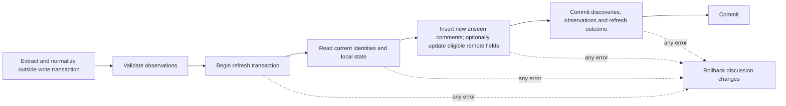

# Database and durable data

SQLite is the durable store. The database contains valuable reader state, not a disposable cache of downloadable comments: remote data cannot reconstruct which individual comments the user processed. The synthetic persistence milestone implements main-owned built-in `node:sqlite`, schema 1, and ordered transactional migrations. See [ADR 0002](decisions/0002-sqlite-and-typed-reader-boundary.md).

The implementation below is deliberately small. Later sections describe the broader conceptual target and must not be read as implemented tables/features. Read the [domain model](DOMAIN_MODEL.md) for meanings and [architecture](ARCHITECTURE.md) for ownership.

## Implemented schema 1

`src/main/persistence` owns path resolution, connection setup, migrations, and explicit row/domain mapping. `content_items` and `comments` store current synthetic content/author metadata and parent relationships; `comment_state` stores local seen state separately; singleton `preferences` stores an explicit optional en/pl choice and System/Light/Dark intent. Fixture ordering is stored so reopen does not reorder the reader. Only internal application IDs are primary keys; no real-source uniqueness constraint is inferred from synthetic IDs. Same-item parent foreign keys, boolean/enumeration/content constraints, and the parent lookup index are tested. Required local state is created atomically with each fixture comment and missing state fails reads.

Timestamps use ISO 8601 UTC TEXT (Z suffix, supplied fixture precision retained). Optional publication timestamps remain NULL; they never receive discovery-time substitutes. Synthetic baseline/first-discovery IDs are stored as labels without refresh-attempt tables. There are no raw payload, undo, search/FTS, backup/export, or workspace tables.

One main-owned synchronous connection configures foreign keys ON explicitly, `busy_timeout=5000`, and `synchronous=FULL`; new files use SQLite's default DELETE rollback journal. Multi-comment state writes and demo inserts use `BEGIN IMMEDIATE`/commit/rollback. This is appropriate for the current tiny dataset, not a large-data responsiveness claim. No pooling, WAL transition, or worker design is selected.

An ordered migration list uses `PRAGMA user_version`: an empty database starts at 0 and migration 1 introduces the complete initial schema/preferences. All pending migrations and their version updates share one transaction. A newer version is rejected before any migration; failures close the connection without resetting/deleting/recreating the file. Tests exercise both version-0 data preservation and a failed later migration over committed version 1. Backup-before-migration remains to be selected before a released schema evolves.

Development uses `<Electron appData>/youtube-comments-development/reader.sqlite`; future packaged production uses `<appData>/youtube-comments-production/reader.sqlite`. Tests supply explicit absolute files in newly created temporary directories and clean only directories they own. Missing/relative test paths or profile roots fail. The privileged `YOUTUBE_COMMENTS_DEMO_ROOT` option selects an absolute alternative development root with the same development-directory suffix, including for packaged checks. Empty/relative values never fall back. Main also separates Chromium `userData` using the chosen profile directory. On Windows the normal appData root is `%APPDATA%`; the renderer receives none of these paths.

Development initialization inserts the two synthetic discussions only into a database with zero content items, transactionally. It never upserts existing fixture data or resets preferences/seen state. Packaged production is not seeded. Explicit preferences and manual comment state survive restart; final tabs/workspace restoration remains open.

## Ownership and access

SQLite belongs to the privileged backend owned by the Electron main-process side. That backend may open the database through application services/repositories or delegate work to an internal database worker. This is a security boundary, not a requirement that every query execute on the main thread. Renderer code requests typed operations through preload/contextBridge and receives neither SQLite/SQL execution nor arbitrary filesystem access. External extractor invocation remains owned by the Electron main process; see [architecture](ARCHITECTURE.md).

Do not use localStorage for durable discussions, seen state, tabs or user preferences. Derived UI caches are not authorities. The renderer may hold currently displayed data, but restart recovery comes from SQLite and documented backup artifacts.

## Conceptual records

| Record | Information and relationships | Important constraints |
| --- | --- | --- |
| Content items | Source kind, source item ID, canonical URL, available item/creator metadata, successful acquisition-baseline association | Stable source identity must be unique under validated source rules |
| Comments | Content item, opaque source comment ID, parent reference, remote content and available metadata | One comment per stable identity; parent relationships remain within the same item |
| Local comment state | Seen/unseen for a particular comment | Required for every comment; new comments start unseen; no thread-level seen flag |
| Discovery/observation information | `publishedAt`, `firstDiscoveredAt`, `lastObservedAt`; first-discovery refresh association | Baseline imports retain discovery history without visual NEW; publication and discovery remain distinct |
| Refresh attempts | Item, timing, outcome, coverage, diagnostics and useful counts | Committed outcome must agree with committed changes |
| Tab/view state | Open tab identities/order and per-tab item, scroll, filters, search, sort, reply expansion and selection | Multiple views share comment state but keep their own view preferences |
| Preferences | Explicit language and appearance choice | Persist intent such as System, not just the resolved current theme |
| Migration metadata | Applied schema versions and runner bookkeeping | Must support ordered, repeatable startup decisions |
| Reversible changes | Information required by the chosen bulk undo/recovery mechanism | Recoverability is required; a previous-state operation log is only one candidate |

These are logical records, not a requirement for one table per row of this list. For example, seen state can share a comments table if refresh code cannot overwrite it, and first discovery can be represented by a refresh foreign key rather than a separate event table. The baseline association must support distinguishing the initial successful import from later refresh discoveries; its physical representation remains open. Do not create a redundant thread seen column or another durable flag derived from comment state.

Raw extractor payloads, diagnostic files, avatar caches and backups may require separate managed files. Their retention, paths and relationship to the database need explicit decisions; none replaces normalized domain storage. See [extractors](EXTRACTORS.md) and [packaging](PACKAGING.md).

## Constraints and indexes

The proposed source key is `(source kind, source content item ID, source comment ID)`, expressed through appropriate item relations. Validate real backend ID guarantees before choosing final uniqueness constraints. Internal keys may simplify relations but must not replace source-key deduplication.

Parent relationships, refresh references and local state should have enforceable relational integrity where possible. SQLite foreign-key enforcement must be configured and verified for every relevant connection if the selected design uses foreign keys. Cycle detection and domain-specific relationship validation still belong in domain logic: a foreign key alone cannot establish a valid conversation tree.

Expected lookup patterns include source identity, item membership, parent/child traversal, publication ranges, seen state, refresh discovery membership and tab restoration. Initial search/filter queries cover all stored comments in the active discussion; default bulk scope is also the active discussion. Index choices should follow those queries and measured representative datasets. Do not commit to an index or full-text strategy without verifying the required ordinary substring, case and opt-in regex semantics. A full-text index alone may not satisfy those semantics. See [filtering and search](FILTERING_AND_SEARCH.md).

Comments without reliable publication times must not receive discovery times in that field just to satisfy a schema constraint. Schema 1 chooses fixture UTC TEXT and nullable optional fields with inline author metadata. Timestamp precision/canonicalization for future real observations, normalized author identity, and real orphan handling remain open.

## Transaction boundaries

All discussion changes accepted from a refresh belong to one transaction, along with the committed history/discovery information that describes them. A process failure outside that transaction may still produce a failed-attempt history record without touching the prior snapshot. [ADR 0003](decisions/0003-extractor-observations-and-normalization.md) accepts valid partial/unknown observational input without implementing any database writes. [Refresh and merge](REFRESH_AND_MERGE.md) describes remaining conflict/baseline/history/outcome policy and crash reconciliation.

Multi-comment seen operations should be atomic. Undo/recoverability is a required part of bulk-action design, but its mechanism is unresolved. Capturing previous states in the same transaction is an optional candidate, not a mandated implementation; a future decision must define how the chosen mechanism remains consistent with state changes. An operation cannot report success after only part of its target set was written. Apply changes / Update view does not commit seen edits; they have already been persisted.

Matching-only bulk commands receive the last applied active-filter matching IDs from the active discussion, with backend validation of their scope. They do not replace that set with a fresh database predicate merely because seen state has changed since evaluation. Raw search matches and contextual IDs must stay distinct from these targets. A successful explicit remote Refresh commits its merge and then triggers active-view recomputation; Apply recomputes without extraction. See [seen state](SEEN_STATE.md).

Service boundaries must prevent an in-flight refresh from overwriting a manual seen change. The eventual write scheduling/concurrency policy should also define ordering for multiple windows/tabs, overlapping refreshes, and reversible operations. Thread-safe use of a driver, synchronous versus asynchronous calls, connection counts, busy handling and journaling mode remain implementation decisions.

## Migrations

Schema migrations are part of the product, including packaged builds. Use explicit schema versioning and a migration runner; do not rely on ad hoc startup `CREATE TABLE` calls as the whole evolution strategy.

Required design outcomes are:

- Opening a supported older database applies a known ordered migration path.
- A failed migration does not silently discard data or recreate an empty database.
- Opening an unsupported newer database produces a clear failure rather than destructive downgrade behavior.
- Migration tests verify both schema and preserved user data, especially seen state and source identities.
- Development resets and test helpers cannot target the user's real database.

Choose a backup-before-migration policy, failure/retry behavior and supported upgrade paths before the first released schema evolves. Some operations may require special handling outside a simple migration transaction; that is a reason to design and test recovery, not to assume all migration failures are harmless. Changes with substantial compatibility consequences should receive [ADRs](decisions/README.md).

## Data locations and environment isolation

Production, development and test data are isolated through the implemented profile strategy above and [ADR 0002](decisions/0002-sqlite-and-typed-reader-boundary.md). Tests always receive explicit temporary paths. Final backup/raw-file retention, uninstall behavior, and export locations remain open with [packaging](PACKAGING.md).

Never let a missing development/test path fall back to the installed application's database. Test and reset utilities must validate the intended environment and target before modifying data. Tests should own and clean up only the temporary directories they create. A packaged build should have a stable production data location that application upgrades do not overwrite.

No real user database, private extraction or credentials should enter source control as fixtures. Use deliberately prepared fixtures and databases under [testing](TESTING.md).

## Backup, restore and export

Plan a backup/restore workflow from the beginning. A correct backup must be a consistent SQLite snapshot, including any active journaling implications. Copying only the main database file while it is changing is not an acceptable unexamined strategy. Choose an appropriate SQLite backup mechanism or documented closed-database procedure for the selected driver and journaling mode.

Restoring should validate the artifact and schema compatibility before replacing active data, preserve a recoverable copy of the current database, and handle open connections and application restart/reload deliberately. The UI, retention policy, automatic versus manual backup triggers, destination, failure handling, and replacement confirmation are unresolved; this document does not authorize automatic destructive restores.

Eventual discussion export serves portability/sharing and is distinct from complete backup. Export format, whether it includes seen state and discovery history, and whether re-import is supported are unresolved. Do not promise export/import round-tripping before specifying those semantics.

## Performance and verification

The target is thousands to tens of thousands of comments per discussion. Measure read/query behavior and state operations at that scale; virtualized rendering alone does not make a blocking database/search path acceptable. Filtering, search, tree building and navigation use application data independently of mounted DOM nodes. Indexes, batching, caches or workers are implementation choices guided by the required semantics.

Use temporary SQLite databases for integration tests of migrations, source-key uniqueness, baseline/first discovery, refresh rollback, missing comments, seen-state preservation, multi-comment atomicity, active-discussion scope, last-applied matching targets and restoration of durable preferences/view state. Tests should include populated old-schema fixtures when migrations exist and verified backup/restore behavior when implemented. See [testing](TESTING.md).

Before a storage increment opens or changes durable data, choose the driver/native-module approach, initial schema and identity constraints, timestamp conventions, migration mechanism, connection ownership and isolated development/test paths needed by that increment. Resolve source collision, parent and partial-result policies before the associated ingestion writes. The final backup implementation, undo mechanism/retention, export format, raw-diagnostic retention and exact restored-view representation remain open until their dependent work is scoped; they are not universal gates before scaffolding or domain-only work. Data protection and eventual backup/restore remain product requirements throughout. These dependency notes do not define the first implementation milestone. Track choices in [decision records](decisions/README.md); [packaging](PACKAGING.md) must reflect any driver or helper distribution decision.
