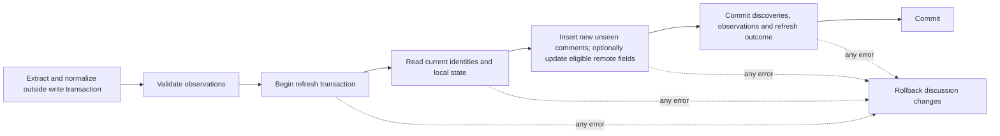

# Database and durable data

SQLite is the durable store for valuable discussion and manual processing data. Main-owned built-in `node:sqlite` now uses schema 7 with ordered transactional migrations. ADRs [0002](decisions/0002-sqlite-and-typed-reader-boundary.md), [0004](decisions/0004-durable-observation-merge.md), [0005](decisions/0005-live-helper-execution-and-acquisition-ipc.md) and [0006](decisions/0006-compact-reader-and-persistent-tabs.md) describe persistence, normalized history, live acquisition and the bounded tab workspace. [ADR 0011](decisions/0011-virtualized-overview-and-durable-new.md) adds explicit attempt order and derived durable NEW. [ADR 0014](decisions/0014-main-owned-helper-settings.md) adds separate profile-local helper selections.

The implementation below is deliberately small. Later sections describe the broader conceptual target and must not be read as implemented tables/features. Read the [domain model](DOMAIN_MODEL.md) for meanings and [architecture](ARCHITECTURE.md) for ownership.

## Schema 6 bounded seen recovery

[ADR 0013](decisions/0013-atomic-bulk-seen-and-durable-undo.md) adds
`comment_state.revision INTEGER NOT NULL DEFAULT 0 CHECK(revision >= 0)`.
Existing seen values remain unchanged; actual transitions increment revisions,
including ordinary clicks, subtree/bulk writes and restoration. Refresh only
inserts new state rows (unseen, revision zero), never updates existing state.

`seen_operations(id, item_id UNIQUE, created_at, kind, target_seen, target_count,
changed_count)` stores at most one recovery per discussion. Safe kinds are all,
matching, publication and subtree. `seen_operation_entries(operation_id, item_id,
comment_id, written_revision)` stores only actual changed rows. Composite foreign
keys enforce operation/item and comment/item ownership, with cascading deletion.
The prior seen value is the inverse of the operation's uniform target, avoiding
per-entry duplicate values. No query text, criteria history or extractor dump is
copied. Bootstrap exposes only safe descriptors, never revisions or entry rows.

One transaction resolves targets, changes states and replaces/creates recovery.
Undo conditionally restores only still-owned rows and consumes the record in one
transaction; changed-away-and-back rows remain stale. All-stale recovery is a
successful consumed attempt. No-op/failure/single-row edits retain prior recovery.
Bulk with multiple targets and one actual change records that change; Ctrl+click
requires more than one actual change. Closing tabs, Apply, Refresh and restart
retain it without expiry; discussion removal deletes it. No redo/stack exists.

A 50k changed operation keeps 50k small entries, not an unbounded history stack.
Prepared statements and indexes keep row work linear. Undo/deletion frees rows
for SQLite reuse; no automatic VACUUM or database compaction is introduced.
Measured generated costs and migration/rollback tests are in [Testing](TESTING.md).

## Schema 5 attempt chronology

`extraction_attempts.attempt_order` freezes existing insertion order during the
additive schema-4 to 5 migration. An AFTER INSERT trigger assigns the next ordinal
within the same short transaction as history/merge. A positive-order unique index
and item/outcome/order index protect and serve the derived latest accepted attempt.
UTC clock ties/regressions, UUID sorting and later VACUUM cannot reorder this fact.
Migration failure rolls back column/index/trigger/version changes; all discussion,
manual state, discovery/history identities and workspace data are preserved.

Main exposes latest accepted attempt identity in its existing item projection.
The domain compares it with baseline and comment first discovery to derive NEW;
no per-comment mutable flag, new renderer command or persisted renderer state is
introduced. Failure does not advance accepted order; accepted partial/unknown,
empty/unavailable and zero-discovery attempts replace the cohort. Future history
retention/export/import must preserve order or an equivalent explicit chronology.

## Schema 4 unified workspace and local removal

[ADR 0007](decisions/0007-unified-workspace-and-library-removal.md) migrates the old
discussion-only workspace preserving exact open order, active identity and revision.
It adds no app tabs and touches no content/comments/state/history/preferences.
`workspace_tabs(id, kind, item_id, position)` uses application IDs
`discussion:<internal item ID>`, `library`, `settings`. Kind/identity/ownership
checks and unique item/order constraints enforce singletons. The singleton workspace
references an open tab through `active_tab_id` with deferred FK and keeps revision.
`content_items.position` is independent Library insertion order.

All tab kinds open/close/activate/reorder through short transactions; reordering
keeps active identity and commits only the final pointer/keyboard order. Close
never deletes content. Removal advances revision even when the item was closed,
applies ordinary mixed right/left/empty selection, then deletes local state,
comments, content and attempts belonging to that item/target in one transaction.
Because baseline and attempts form a FK cycle, checks are deferred to commit with
foreign-key enforcement ON. No dangling references survive; late failures roll back
everything. Unrelated items, preferences and app tabs stay untouched.
Synthetic baselines cannot be removed. Main rejects removal of the active helper
source, preventing stale results from recreating deleted content. There is no
remote deletion/helper call or persistent remote tombstone.

## Historical schema 3 workspace extension

Migration 3 adds `workspace_tabs(item_id, position)` referencing stored items with
unique nonnegative order, and singleton `workspace(active_item_id, revision)` with
a deferred foreign key to an open tab. It opens all existing items in library
order and selects the first, or initializes empty/null. Earlier tables/rows remain
unchanged, including old avatar-less JSON. All pending migrations/version updates
remain one transaction; migration failure rolls back without replacing the file.

Open/activate/close writes are immediate short transactions changing only workspace.
Closed items remain in Library with their comments, history and local state. Closing
active selects right, then left, then null; open appends or activates without
duplicates. Successful Acquire opens in its merge transaction; Refresh does not.
Revision protects acknowledgment ordering. `content_items.position` remains library
insertion order. At schema 3 there was no reorder/deletion UI; schema 4 supplies these above. Persisted scroll/filter/expansion remain future work.

Avatar evidence uses existing checked `remote_json`, with no avatar column/migration.
Old authors default absent evidence to unavailable in memory; synthetic-history
creation includes unknown avatar evidence. Author projection reads the observed
usable HTTPS URL directly from normalized JSON; scalar author columns remain unchanged.

## Schema 2 normalized history foundation

Migration 2 extends schema 1 without deleting/recreating tables. Unique indexes enforce content identity in its kind scope and source comment identity within its item. Reader `video`/`post` kinds map one-to-one to the observation source families. Internal IDs remain distinct: new items/comments/attempts use an injected factory (main defaults to UUIDs); existing IDs survive migration.

Current normalized remote evidence is stored in checked JSON on each item/comment, alongside the retained reader scalar columns. It preserves authority, canonical URLs, item likes/counts, author fields, publication evidence and Community image/link metadata without a media subsystem. Publication stores instant and label precision/estimatedness separately when both exist. Unknown fields cannot erase observed values; trustworthy empty/zero/false can update. No raw backend dumps or historical text/like versions are stored.

`extraction_attempts` stores attempt ID, optional item/target, UTC time, backend/version, coverage/evidence, accepted/failed outcome, collection status, counts and sanitized structured issues/provenance. Baseline, first and last attempt references use foreign keys and same-item accepted-history consistency triggers. Accepted existing-comment counts include unchanged observations, not only changed remote values. Failed normalization records history only; database-write failure rolls back history with all candidate writes.

Relationships retain top-level/direct-parent/thread-containment truth and unresolved opaque targets in remote evidence. The reader derives safe placement from the entire item, making missing targets and cycle members display roots without altering source truth. Legacy `parent_id` is retained for schema-1 fixtures; it is not authoritative for ingested display trees. Later resolution needs no child-row write. There is no inferred deletion.

Migration explicitly establishes synthetic history from old discovery labels and observation timestamps while preserving all 24 demo comments, metadata, ordering, seen and preferences. Fresh demo seeding does the same in its existing empty-library transaction. Repeated initialization never resets existing library state. The nullable evidence/reference columns permit staged legacy fixture insertion within that transaction; reader operations fail on missing evidence rather than inventing it.

## Schema-1 compatibility foundation

`src/main/persistence` owns path resolution, connection setup, migrations, and explicit row/domain mapping. `content_items` and `comments` store current synthetic content/author metadata and parent relationships; `comment_state` stores local seen state separately; singleton `preferences` stores an explicit optional en/pl choice and System/Light/Dark intent. Fixture ordering is stored so reopen does not reorder the reader. Internal application IDs remain primary keys. Schema 1 originally had no real-source uniqueness constraints; schema 2 adds the conservative owner-approved source scopes above. Same-item parent foreign keys, boolean/enumeration/content constraints, and the parent lookup index are tested. Required local state is created atomically with each fixture comment and missing state fails reads.

Timestamps use ISO 8601 UTC TEXT (Z suffix, supplied precision retained). Optional publication timestamps remain NULL; they never receive discovery-time substitutes. Synthetic labels identify synthetic history. Schema 2 had no raw payload, undo, search/FTS or backup/export tables; schema 6 adds bounded seen recovery below. Schema 3 adds the separate bounded workspace above.

One main-owned synchronous connection configures foreign keys ON explicitly, `busy_timeout=5000`, and `synchronous=FULL`; new files use SQLite's default DELETE rollback journal. Multi-comment state writes and demo inserts use `BEGIN IMMEDIATE`/commit/rollback. This is appropriate for the current tiny dataset, not a large-data responsiveness claim. No pooling, WAL transition, or worker design is selected.

An ordered migration list uses `PRAGMA user_version`: an empty database starts at 0 and migration 1 introduces the complete initial schema/preferences. All pending migrations and their version updates share one transaction. A newer version is rejected before any migration; failures close the connection without resetting/deleting/recreating the file. Tests exercise version-0 preservation, populated 1→2 preservation/rollback and failed later migrations over the current schema. Backup-before-migration remains to be selected before a released schema evolves.

Development uses `<Electron appData>/youtube-comments-development/reader.sqlite`; future packaged production uses `<appData>/youtube-comments-production/reader.sqlite`. Tests supply explicit absolute files in newly created temporary directories and clean only directories they own. Missing/relative test paths or profile roots fail. The privileged `YOUTUBE_COMMENTS_DEMO_ROOT` option selects an absolute alternative development root with the same development-directory suffix, including for packaged checks. Empty/relative values never fall back. Main also separates Chromium `userData` using the chosen profile directory. On Windows the normal appData root is `%APPDATA%`; the renderer receives none of these paths.

Development initialization inserts/opens the two synthetic discussions only into a database with zero content items, transactionally. It never resets existing preferences/seen/workspace, including an empty workspace over a nonempty library. Packaged production is not seeded. Tab IDs/order/active selection, preferences and manual state survive restart; full view restoration remains open.

## Ownership and access

SQLite belongs to the privileged backend owned by the Electron main-process side. That backend may open the database through application services/repositories or delegate work to an internal database worker. This is a security boundary, not a requirement that every query execute on the main thread. Renderer code requests typed operations through preload/contextBridge and receives neither SQLite/SQL execution nor arbitrary filesystem access. External extractor invocation remains owned by the Electron main process; see [architecture](ARCHITECTURE.md).

Do not use localStorage for durable discussions, seen state, tabs or user preferences. Derived UI caches are not authorities. The renderer may hold currently displayed data, but restart recovery comes from SQLite and documented backup artifacts.

## Conceptual records

| Record | Information and relationships | Important constraints |
| --- | --- | --- |
| Content items | Source kind, source item ID, canonical URL, available item/creator metadata, successful acquisition-baseline association | Stable source identity must be unique under validated source rules |
| Comments | Content item, opaque source comment ID, parent reference, remote content and available metadata | One comment per stable identity; parent relationships remain within the same item |
| Local comment state | Seen/unseen for a particular comment | Required for every comment; new comments start unseen; no thread-level seen flag |
| Discovery/observation information | `publishedAt`, `firstDiscoveredAt`, `lastObservedAt`; first-discovery refresh association | Baseline imports retain discovery history without visual NEW; publication and discovery remain distinct |
| Refresh attempts | Item, timing, outcome, coverage, diagnostics and useful counts | Committed outcome must agree with committed changes |
| Tab/view state | Open tab identities/order and per-tab item, scroll, filters, search, sort, reply expansion and selection | Multiple views share comment state but keep their own view preferences |
| Preferences | Explicit language and appearance choice | Persist intent such as System, not just the resolved current theme |
| Migration metadata | Applied schema versions and runner bookkeeping | Must support ordered, repeatable startup decisions |
| Reversible changes | Information required by the chosen bulk undo/recovery mechanism | Schema 6 stores one operation per item and changed IDs/written revisions (ADR 0013) |

These are logical records, not a requirement for one table per row of this list. For example, seen state can share a comments table if refresh code cannot overwrite it, and first discovery can be represented by a refresh foreign key rather than a separate event table. Schema 2 implements baseline and per-comment first/last attempt references; future presentation must retain the initial-versus-later distinction. Do not create a redundant thread seen column or another durable flag derived from comment state.

Raw extractor payloads, diagnostic files, avatar caches and backups may require separate managed files. Their retention, paths and relationship to the database need explicit decisions; none replaces normalized domain storage. See [extractors](EXTRACTORS.md) and [packaging](PACKAGING.md).

## Constraints and indexes

The proposed source key is `(source kind, source content item ID, source comment ID)`, expressed through appropriate item relations. ADR 0004 chooses conservative item-scoped comment uniqueness, without asserting global source-comment uniqueness. Internal keys may simplify relations but must not replace source-key deduplication.

Parent relationships, refresh references and local state should have enforceable relational integrity where possible. SQLite foreign-key enforcement must be configured and verified for every relevant connection if the selected design uses foreign keys. Cycle detection and domain-specific relationship validation still belong in domain logic: a foreign key alone cannot establish a valid conversation tree.

Expected lookup patterns include source identity, item membership, parent/child traversal, publication ranges, seen state, refresh discovery membership and tab restoration. Initial search/filter queries cover all stored comments in the active discussion; default bulk scope is also the active discussion. Index choices should follow those queries and measured representative datasets. Do not commit to an index or full-text strategy without verifying the required ordinary substring, case and opt-in regex semantics. A full-text index alone may not satisfy those semantics. See [filtering and search](FILTERING_AND_SEARCH.md).

Comments without reliable publication times must not receive discovery times in that field just to satisfy a schema constraint. Schema 1 chooses fixture UTC TEXT and nullable optional fields with inline author metadata. Schema 2 preserves real observation precision/labels and unresolved source relationships; date-query canonicalization and any separate normalized-author entity remain open.

## Transaction boundaries

All discussion changes accepted from a refresh belong to one transaction, along with the committed history/discovery information that describes them. A process failure outside that transaction may still produce a failed-attempt history record without touching the prior snapshot. [ADR 0003](decisions/0003-extractor-observations-and-normalization.md) accepts valid partial/unknown observational input without implementing any database writes. [ADR 0004](decisions/0004-durable-observation-merge.md) implements conflict/baseline/history/outcome policy; future process crash reconciliation remains open.

Multi-comment seen commands and recovery are atomic under ADR 0013. Target resolution, state/revision updates, operation replacement and changed-entry creation commit together. Undo conditional restoration and log consumption also commit together. Failed transactions preserve prior states, revisions and recovery. Apply recomputes views; seen changes have already been saved.

Matching-only bulk commands receive the last applied active-filter matching IDs from the active discussion, with backend validation of their scope. They do not replace that set with a fresh database predicate merely because seen state has changed since evaluation. Raw search matches and contextual IDs must stay distinct from these targets. A successful explicit remote Refresh commits its merge and then triggers active-view recomputation; Apply recomputes without extraction. See [seen state](SEEN_STATE.md).

Service boundaries must prevent an in-flight refresh from overwriting a manual seen change. The eventual write scheduling/concurrency policy should also define ordering for multiple windows/tabs, overlapping refreshes, and reversible operations. Thread-safe use of a driver, synchronous versus asynchronous calls, connection counts, busy handling and journaling mode remain implementation decisions.

## Migrations

Schema migrations are part of the product, including packaged builds. Use explicit schema versioning and a migration runner; do not rely on ad hoc startup `CREATE TABLE` calls as the whole evolution strategy.

Required design outcomes are:

- Opening a supported older database applies a known ordered migration path.
- A failed migration does not silently discard data or recreate an empty database.
- Opening an unsupported newer database produces a clear failure rather than destructive downgrade behavior.
- Migration tests verify both schema and preserved user data, especially seen state and source identities.
- Development resets and test helpers cannot target the user's real database.

Choose a backup-before-migration policy, failure/retry behavior and supported upgrade paths before the first released schema evolves. Some operations may require special handling outside a simple migration transaction; that is a reason to design and test recovery, not to assume all migration failures are harmless. Changes with substantial compatibility consequences should receive [ADRs](decisions/README.md).

## Data locations and environment isolation

Production, development and test data are isolated through the implemented profile strategy above and [ADR 0002](decisions/0002-sqlite-and-typed-reader-boundary.md). Tests always receive explicit temporary paths. Final backup/raw-file retention, uninstall behavior, and export locations remain open with [packaging](PACKAGING.md).

Never let a missing development/test path fall back to the installed application's database. Test and reset utilities must validate the intended environment and target before modifying data. Tests should own and clean up only the temporary directories they create. A packaged build should have a stable production data location that application upgrades do not overwrite.

No real user database, private extraction or credentials should enter source control as fixtures. Use deliberately prepared fixtures and databases under [testing](TESTING.md).

## Backup, restore and export

Plan a backup/restore workflow from the beginning. A correct backup must be a consistent SQLite snapshot, including any active journaling implications. Copying only the main database file while it is changing is not an acceptable unexamined strategy. Choose an appropriate SQLite backup mechanism or documented closed-database procedure for the selected driver and journaling mode.

Restoring should validate the artifact and schema compatibility before replacing active data, preserve a recoverable copy of the current database, and handle open connections and application restart/reload deliberately. The UI, retention policy, automatic versus manual backup triggers, destination, failure handling, and replacement confirmation are unresolved; this document does not authorize automatic destructive restores.

Eventual discussion export serves portability/sharing and is distinct from complete backup. Export format, whether it includes seen state and discovery history, and whether re-import is supported are unresolved. Do not promise export/import round-tripping before specifying those semantics.

## Performance and verification

The target is thousands to tens of thousands of comments per discussion. Measure read/query behavior and state operations at that scale; virtualized rendering alone does not make a blocking database/search path acceptable. Filtering, search, tree building and navigation use application data independently of mounted DOM nodes. Indexes, batching, caches or workers are implementation choices guided by the required semantics.

Use temporary SQLite databases for integration tests of migrations, source-key uniqueness, baseline/first discovery, refresh rollback, missing comments, seen-state preservation, multi-comment atomicity, active-discussion scope, last-applied matching targets and restoration of durable preferences/view state. Tests should include populated old-schema fixtures when migrations exist and verified backup/restore behavior when implemented. See [testing](TESTING.md).

Before a storage increment opens or changes durable data, choose the driver/native-module approach, initial schema and identity constraints, timestamp conventions, migration mechanism, connection ownership and isolated development/test paths needed by that increment. Resolve source collision, parent and partial-result policies before the associated ingestion writes. The final backup implementation, export format, raw-diagnostic retention and exact restored-view representation remain open until their dependent work is scoped; they are not universal gates before scaffolding or domain-only work. Data protection and eventual backup/restore remain product requirements throughout. These dependency notes do not define the first implementation milestone. Track choices in [decision records](decisions/README.md); [packaging](PACKAGING.md) must reflect any driver or helper distribution decision.

## Profile-local helper configuration (schema 7)

[ADR 0014](decisions/0014-main-owned-helper-settings.md) adds a separate strict
helper_settings table keyed by the two fixed helper identities, containing only
validated/probed saved executable selections. No row means automatic detection.
Startup overrides are not persisted. The additive transactional schema-6 migration
preserves content, seen revisions, history, workspace, preferences and durable Undo.
Selections survive restart and local discussion removal, and remain independent in
development/production/test profiles. The table never enters discussion or Preferences
DTOs; only narrow Settings path/status evidence is returned through validated IPC.
