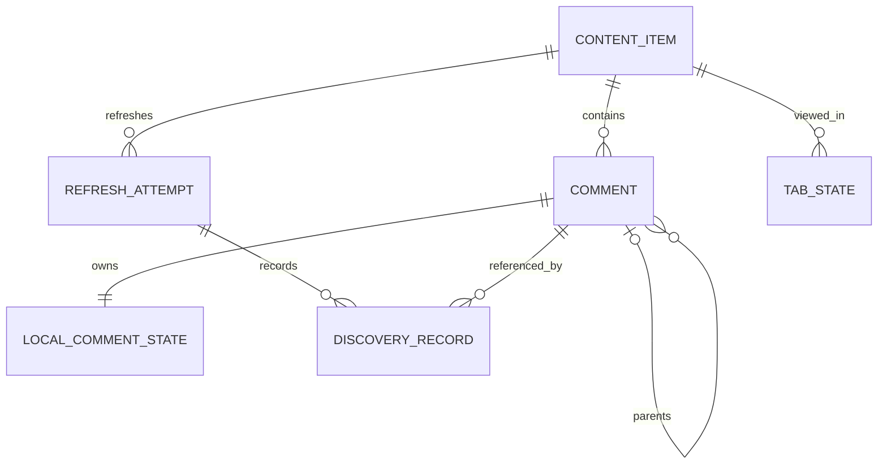

# Domain model

This is the target application model, not a database schema. `src/domain/discussion.ts` implements the stored synthetic reader's content/author/comment types, complete-tree construction/traversal, and immutable manual seen actions. Main-owned repositories map SQLite rows explicitly; shared IPC contracts contain no SQL/driver types. `src/fixtures` supplies synthetic initialization only. Strict valid-tree preconditions remain scoped as in [ADR 0001](decisions/0001-synthetic-reader-foundation.md); [ADR 0002](decisions/0002-sqlite-and-typed-reader-boundary.md) chooses fixture UTC TEXT and separate local-state writes. `src/domain/extraction-observation.ts` now separately describes pure remote observations in [ADR 0003](decisions/0003-extractor-observations-and-normalization.md). Pure merge planning, durable normalized evidence/history and safe reader relationship projection are implemented in [ADR 0004](decisions/0004-durable-observation-merge.md). ADR 0005 connects live helper execution and acquisition/refresh UI to these same domain/merge rules. [Product requirements](PRODUCT_REQUIREMENTS.md) define the target; [architecture](ARCHITECTURE.md) describes ownership.

The model uses the same application concepts for video discussions and Community Post discussions. Extractor-specific fields belong in [adapter input types](EXTRACTORS.md), never in React component contracts.

## Identity and ownership

[ADR 0007](decisions/0007-unified-workspace-and-library-removal.md) distinguishes
**Library** (all stored items), **workspace** (ordered generic open tabs and nullable
active application tab ID), **discussion** (remote/discovery/history/manual state),
and **view** (temporary presentation). Discussion is singleton per internal item ID;
Library/Settings are singleton app views. None has a reserved position. Close owns
only the view; explicit confirmed Library removal owns deletion of local discussion
data. WorkspaceState revision orders responses; pure open/close/move functions
define singleton, mixed-neighbor and active-preserving reorder rules.
Only identities/order/active selection restore, not later per-view scroll/filter/
sort/expansion/selection. Structural rail styling never changes source relationships
or manual per-comment seen state.

AuthorObservation now contains `avatarUrl: ObservedField<string>`. A usable HTTPS
URL is remote evidence, never UI loading state. Missing/invalid/lossy values cannot
clear known URLs; newer observed URLs update. Old stored JSON without the field
loads with unavailable evidence. Reader Author exposes optional `avatarUrl`; failed
image/fallback state belongs solely to the renderer. See
[ADR 0006](decisions/0006-compact-reader-and-persistent-tabs.md).

A **content item** is one YouTube video or one public individual Community Post whose discussion is stored locally. A **comment** is one individually addressable contribution to that discussion, including a top-level comment or any reply. A **thread** is the top-level comment and its complete descendant conversation tree. A thread is a structural grouping, not a separately processed inbox item.

Observation source identity is `(content source kind, opaque source content item ID, opaque source comment ID)`. This conservatively scopes a comment to its discussion rather than assuming global uniqueness. `youtube-video` and `youtube-community-post` identify content families, not executable backends. Switching adapters must not create a second identity for the same remote comment. Schema 2 enforces source-kind-scoped item identity and item-scoped comment identity; backend provenance never changes source identity.

Preserve source IDs as opaque values. Display names, text, timestamps, array positions, current sort order, and DOM positions are not identities. The conservative scope is now constrained in schema 2; stronger source guarantees or additional source families require further evidence before changing it. See [extractors](EXTRACTORS.md) and [database constraints](DATABASE.md).

An internal local identifier may make database relations and UI navigation simpler. If used, it supplements the stable source identity and must survive refresh. New internal identities use an injected UUID factory; schema-1 identities are preserved.

The diagram shows conceptual relationships, not required physical tables. In particular, local comment state may share a row with remote comment data while retaining separate ownership in application code.

## Main concepts

| Concept | Meaning and useful information | Ownership |
| --- | --- | --- |
| Content item | Source kind and ID, canonical URL, available title/creator/source metadata, acquisition-baseline association | Remote metadata with local identity and local acquisition history |
| Comment | Stable source identity, content item, parent reference, original content, available author and display metadata | Remote-observed fields |
| Local comment state | Seen/unseen for that one comment | User-controlled, durable |
| Thread | One top-level comment and all stored descendants | Derived from comment relationships |
| Refresh attempt | An acquisition or refresh attempt, timing, outcome, coverage and diagnostic information | Local operational history |
| Discovery record | Which stored comments were first discovered in an acquisition or refresh, including the baseline import | Local discovery history; first-discovery attempt references in schema 2 |
| Filter specification | Search, dates, seen condition and other enabled predicates | Per-view user choice |
| Applied view | Applied active-filter matching IDs, containing thread IDs, contextual IDs and ordering from the last applied evaluation | Session DiscussionViewResult snapshot (ADR 0008) |
| Tab state | Open content item and the view's scroll, filters, search, sorting, expansion and selection state | Durable user preference/view state |
| Application preferences | Language and System/Light/Dark appearance | Durable user preference |
| Reversible state change | Information needed by the chosen bulk-action undo/recovery design | Recoverability is required; mechanism, storage and lifetime are open |

The model should expose only metadata actually available from a source. An absent avatar, like count, handle, publication time or creator badge must not become fabricated data. Absence and explicit removal may have different meanings when merging; adapters need to preserve that distinction where their inputs permit it.

## Comment relationships and authors

Observation relationships explicitly distinguish `top-level`, `direct-parent` and `thread-containment`. yt-dlp's literal root sentinel and direct IDs are preserved; Community's nested output establishes only containing-root membership in the verified contract. Sorting must preserve relationship evidence. A direct replied-to author may be derived only from a genuinely known direct parent, never from a containing root fallback. These are distinct [search targets](FILTERING_AND_SEARCH.md).

Author identity and author display information are also different. A display name or handle can change and need not uniquely identify an account. Preserve available stable source author identifiers separately from names, handles and avatars. An author search must state which fields it searches rather than treating a display label as an ID.

Adapters report missing/cyclic references and duplicate identities without repairing relationships or choosing a candidate. All duplicate observations remain available with occurrence diagnostics. Invalid required shape is unusable; invalid optional fields become unknown. Ingestion skips every occurrence of ambiguous identities while retaining independent candidates. It stores unresolved/cyclic relationship truth without dropping comments. A separate pure projection resolves same-item targets; missing targets and every cycle member display as roots, preserving other descendants. Later resolution can improve placement without a child-row write. The strict reader tree builder receives this safe projection, not arbitrary observation batches. [Extractor normalization](EXTRACTORS.md), [refresh validation](REFRESH_AND_MERGE.md), and [tree tests](TESTING.md) must agree before ingestion.

`ObservedField<T>` distinguishes an observed value from unknown, including unavailable, lossy-default, unreliable, invalid and unsupported reasons. A trustworthy explicit empty/zero/false can be observed; a helper default cannot clear useful remote data. Publication observations retain available instants, source labels, precision and estimatedness independently. yt-dlp comment instants remain coarse estimates; Community relative labels are not converted using a clock. Collection availability is independent of unknown/partial/failed coverage. There is no seen state, discovery or deletion action in an extractor observation.

## Remote fields and local fields

Remote-observed fields include text, parent information, author/display metadata, publication time, like count, pin status and creator indication where available. Refresh may update eligible fields when newer valid information is available under documented adapter semantics; it is not required to mutate every remote field on every refresh.

Local fields include seen state, first discovery information, refresh history and view preferences. A remote observation is not allowed to overwrite user-owned seen state. A merge service should make these ownership rules explicit rather than copying an extractor object over a stored comment.

| Information | Required meaning |
| --- | --- |
| Publication time (`publishedAt`) | When the comment was published according to the remote source; not when it was downloaded |
| First-discovered time (`firstDiscoveredAt`) | When this comment was first accepted into the local dataset, including the baseline acquisition; retained across later observations |
| Last-observed time (`lastObservedAt`) | Most recent accepted refresh observation of this comment; absence from a refresh does not advance it |
| First-discovered refresh | Refresh association sufficient to identify the comments first discovered in an attempt |
| Seen state | Durable state explicitly controlled by the user |
| Remote edit time, if supplied | A separate optional observation; never a replacement for publication time |

Schema 2 stores UTC discovery/observation instants and normalized publication labels/precision, with separate instant/label evidence when needed. Missing or imprecise remote timestamps need an explicit policy; substituting discovery time would change the meaning of [publication-date filters and bulk actions](FILTERING_AND_SEARCH.md).

## New, unseen and matching are independent

**New** concerns discovery history, with the initial successful acquisition treated as a baseline for visual NEW indicators. **Unseen** describes the user's current durable per-comment state. A **raw search match** satisfies the search condition alone. An **applied active-filter match** satisfies the complete active filter combination in the last applied evaluation. A **contextual comment** is included because another comment in its thread is an applied active-filter match, without itself belonging to that matching set.

The first successful acquisition establishes the content item's baseline. Its imported comments are unseen and receive `firstDiscoveredAt` and discovery history, but do not receive visual NEW badges or markers. Comments first discovered by subsequent refreshes are eligible for visual NEW indicators. Valid partial/unknown batches are accepted non-destructively and can establish the first baseline, including empty/unavailable collections; their true coverage remains in history. See [refresh and merge](REFRESH_AND_MERGE.md).

For example, after a baseline exists, a reply published months ago can be first discovered today, making it eligible for NEW in today's refresh and inserted unseen. Marking it seen immediately changes its durable state without erasing that discovery event. Its root may be seen and fail an Unseen-only filter, yet still appear as conversational context. A “New since refresh” query concerns discovery history; publication-date filters instead evaluate `publishedAt`.

There is no persistent thread-level seen state. Any thread/tab unseen count is derived from its comments. There is also no rule that a reply inherits its parent's seen state: a newly discovered reply starts unseen even if its whole thread was previously processed. See [seen state](SEEN_STATE.md).

The discovery event should remain meaningful independently of presentation. NEW badges/markers are exactly the latest accepted post-baseline first-discovery cohort (ADR 0011), persisting through restart and replaced even by a zero-insert accepted refresh; presentation must not be implemented by changing seen state or deleting refresh history.

## Query criteria and result types

[ADR 0010](decisions/0010-variable-height-discussion-virtualization.md) adds a pure
renderer presentation projection, without altering domain Comment or query result
types. Flat rows use applied frozen display placement, exact depth/root/sibling
metadata and shared linked ancestry. Source direct-parent/Community containment
truth stays on the original comment. Live seen and session selection never alter
applied matching membership. Geometry, refs and measurements stay in the renderer.

`src/domain/discussion-query.ts` implements DiscussionQuery: one expression,
content/author/direct-replied-to-author field selection, text/regex, case sensitivity
and All/Unseen/Seen. Selected fields OR; seen ANDs on the same comment. NFC
substring comparison with deterministic lowercase and ECMAScript u/iu regex are
specified in [ADR 0008](decisions/0008-active-discussion-applied-queries.md).
QueryComment is a narrow application projection without source/SQLite/raw schemas.
Direct author requires resolved genuine direct-parent identity and metadata.

DiscussionViewResult freezes raw/active IDs, containing-root IDs, complete visible
preorder and display parents, ordered matches, counts, restrictive/search-active
flags. Query errors are explicit outcomes, not zero-match results. Navigation
resolves wrap candidates in data preorder; unseen candidates derive separately
from current saved seen within visible IDs. Initial unrestricted identity traversal
has no search comparison or noisy match presentation. Inputs are immutable.
Criteria/result semantics remain independent of the renderer worker execution site.

## Evaluated views are not copies of durable state

Initial search and filtering operate over every locally stored comment in the active discussion. Applying the complete filter combination produces an applied active-filter matching-comment set and its containing-thread set. Context expansion includes every stored comment in each containing conversation tree. Applied matching IDs and context-only IDs remain distinguishable even if presentation hides some replies behind a collapse control or virtualizes their rendering.

After a seen-state edit, the database has the new value immediately, while visible result membership, order and the applied active-filter matching set stay stable until Apply changes / Update view or a successful explicit remote Refresh. A checkbox can therefore show “seen” on a comment that remains an applied match in an Unseen-only view. Components need both current comment state and the last applied view; inferring one from the other would break this behavior.

Bulk actions on matching comments target the last applied active-filter matching IDs. They do not perform an implicit fresh evaluation and do not substitute raw text-search matches or contextual comments. A successful explicit remote Refresh automatically recomputes the active view after its merge; Apply recomputes using stored data without extraction. The exact visual treatment and any supplementary live indicators remain design choices, but cannot redefine the action's applied matching set. See [filtering](FILTERING_AND_SEARCH.md), [seen-state workflows](SEEN_STATE.md), and [UI navigation](UI_AND_NAVIGATION.md).

Counts distinguish matching comments from containing threads. Navigation targets and overview markers reference comment identities, not mounted DOM elements. Thread ordering belongs to the evaluated view; replies retain their relationships.

## Decisions still to make

- Observation source scope and adapter canonical URL rules are selected in ADR 0003; database uniqueness/internal IDs are selected in ADR 0004; ADR 0005 selects the narrow live URL parser; broader source forms remain open.
- Publication precision/labels are durably stored; date-query semantics remain open.
- Missing/cyclic relationship truth is retained with safe display fallback, and ambiguous identities are skipped (ADR 0004). Thread sorting and future user-facing diagnostics remain open.
- ADR 0011 settles NEW lifetime from the latest accepted post-baseline attempt in explicit durable insertion order, independent of seen/publication. Any future discovery-filter window UI remains open.
- ADR 0008 selects session draft/applied snapshots, explicit Apply/error preservation, badges and saved-seen indications. Persistent result/filter/selection restoration, scroll reconciliation after refresh and broader inactive-tab notifications remain open.
- Choose the exact representation of undoable changes and their retention.

Record consequential choices in [decision records](decisions/README.md). See [database design](DATABASE.md) for proposed storage and [testing](TESTING.md) for executable invariants.

## Durable NEW and overview projection (ADR 0011)

`ContentItem.latestAcceptedDiscoveryId` is a main-derived read projection from accepted history ordered by schema-5 `attempt_order`. `isNewDiscovery(item, comment)` requires that attempt to differ from baseline and equal the comment's existing first-discovery identity. There is no per-comment NEW state. Partial/unknown acceptance replaces the cohort; failure does not.

Renderer `RulerMarker` joins displayed virtual preorder/index, live seen, restrictive applied matches and durable NEW IDs. Pixel buckets retain ordered targets and independent category counts. Geometry comes from the full virtualizer cache rather than mounted-row discovery. It is presentation data, not domain state, and does not broaden query membership or mutation scope.
