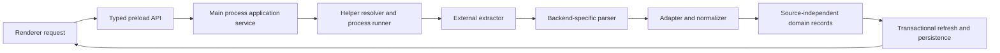

# Extractors and normalization

This document specifies the target extraction boundary. No application adapter or extractor invocation is implemented in the current scaffold. Start with [How it works](HOW_IT_WORKS.md); the surrounding process boundary is described in [Architecture](ARCHITECTURE.md).

## Supported acquisition targets

| Content | Initial backend | Initial product scope |
| --- | --- | --- |
| YouTube video discussion | `yt-dlp` | Acquire and refresh a video's discussion. |
| YouTube Community Post | `post-archiver-improved` | Acquire and refresh a public individual post URL. |

Channel-wide Community Post browsing, authenticated access, and member-only content are later possibilities, not requirements for the initial implementation. Posting, replying, likes, subscriptions, and account integration are outside the [product scope](PRODUCT_REQUIREMENTS.md).

These backend names are requirements, not a claim that a particular installed version supports every desired metadata field or reliably reports extraction completeness. Before implementing an adapter, verify the selected backend version, its actual output, and its invocation against representative fixtures. No command flags or backend output schema are prescribed here.

## Boundary and responsibilities

Only the Electron main process may invoke external extractors. The renderer requests a domain operation such as acquiring or refreshing a content item through the typed API. It does not receive a command runner, filesystem access, shell fragments, raw backend types, or arbitrary process arguments. Database work may use an internal worker owned by the main-side backend without changing this boundary or giving that worker responsibility for extractor invocation. See [Electron boundaries](ARCHITECTURE.md) and [packaging security checks](PACKAGING.md).

The responsibilities below describe the target design; exact TypeScript interfaces and module paths remain implementation decisions.

| Component | Owns | Must not own |
| --- | --- | --- |
| Acquisition service | Validate the requested content target, coordinate extraction, normalization, and refresh reporting. | Rendering or comment seen-state policy inside backend code. |
| Helper resolver | Locate a usable helper for the selected backend and report its identity/version when available. | Hardcoded assumptions that development paths exist on another machine. |
| Process runner | Launch an explicit executable with structured arguments; capture completion, diagnostics, and cancellation/failure information. | Renderer-supplied executable paths or shell command text. |
| Backend parser | Decode and validate that backend's output. | Application domain types that expose backend-specific field names. |
| Adapter/normalizer | Map IDs, parent relationships, author/text/metadata, and evidence about extraction quality into the domain. | Overwrite local seen state or infer deletion from absence. |
| Refresh service | Apply the merge policy and persist the result atomically. | Assume that process success means a complete discussion was returned. |

Remote text, links, and diagnostics are untrusted input. They must remain data across parsing, persistence, IPC, and rendering. In particular, remote comment text must not become executable HTML. Diagnostic storage and user-facing error presentation must not weaken the [security boundary](ARCHITECTURE.md).

## Normalized output

Adapters must return source-independent data as defined by the [domain model](DOMAIN_MODEL.md). Conceptually, a normalized result needs:

- The content item's source, kind, stable source identity, and canonical/permalink information where available.
- Stable source comment IDs and parent relationships sufficient to reconstruct the observed discussion tree.
- Original comment text and available author identity, display name, handle, publication time, likes, pinned state, and creator/uploader information.
- Evidence about the extraction attempt: backend identity/version where obtainable, when it ran, diagnostics, and whether the result is known to be complete, partial, failed, or of unknown completeness.
- Enough information to distinguish a field that was supplied from a field that is unavailable, so absent optional metadata does not accidentally erase a previously useful value.

This is a conceptual contract, not a finalized serialized shape. Availability differs by source and backend. Unknown values must remain unknown; do not invent timestamps, authors, parent records, or metadata to make a row look complete. The exact stable-ID namespace, handling of conflicting duplicate IDs, and representation of missing parents are decisions to settle with [tree construction](DOMAIN_MODEL.md) and fixture evidence.

The adapter does not determine whether a comment is unseen or visually NEW. The merge service recognizes an existing comment by stable source identity, preserves its local state, and inserts a newly discovered comment as unseen. The first successful acquisition establishes the baseline: its comments have `firstDiscoveredAt` and start unseen, but do not receive visual NEW indicators. Comments first discovered by later refreshes are eligible for NEW independently of `publishedAt`; the indicator's lifetime remains unresolved. The adapter also does not decide that a comment missing from output has been deleted. See [Seen state](SEEN_STATE.md) and [Refresh and merge](REFRESH_AND_MERGE.md).

## Failure, partial output, and cancellation

Process failure, malformed output, unsupported output versions, cancellation, and interrupted acquisition must be represented explicitly. Previously valid stored content must survive these outcomes. A zero exit status alone is not sufficient evidence that every comment was returned.

Do not stream partially parsed records directly into the active stored snapshot without the protections required by the refresh policy. Validate and stage candidate data before a transaction changes the discussion. Failed refreshes must not publish a success state; the policy for accepting useful records from partial or uncertain results remains unresolved. Any permitted partial merge must preserve existing records and local state, and describe its limited coverage in refresh history. See the [transaction and partial-refresh policy](REFRESH_AND_MERGE.md).

Record useful diagnostics without presenting raw backend terminology as the only explanation to the user. Application context and recovery messages must be localized; raw extractor messages may be retained for diagnosis. See [Localization and theming](LOCALIZATION_AND_THEMING.md).

## Finding and distributing helpers

Windows is the initial development and packaging target. During development, a resolver may locate helpers through `PATH`. The design must also permit app-local or bundled helpers later and leave room for future Linux/macOS support without requiring those platforms initially. Keep helper resolution separate from backend invocation and normalization so packaging can change without rewriting domain logic.

The following are unresolved: which helper versions to support, Windows distribution artifacts and architecture support, runtime dependencies, resolver precedence, whether a user-configured helper path is needed, update ownership, and offline failure/retry behavior. Future Linux/macOS artifacts need their own decisions if those platforms are added. A helper found on `PATH` is not proof that it is a supported or compatible version. Product-facing diagnostics should explain a missing or incompatible helper without requiring renderer access to process execution.

Bundling requires checking the actual redistribution licenses and obligations for selected artifacts and their dependencies. This document does not assume that the application's own license settles helper redistribution. Distribution, signing, integrity, and update choices belong in [Packaging](PACKAGING.md) and, when decided, small [ADRs](decisions/README.md).

## Verification and open decisions

Adapter tests should use saved representative output fixtures, including unavailable metadata, malformed records, unexpected parent order, and partial output. Tests must prove that backend-specific types stop at the adapter boundary. Normal CI must not require network access or an installed extractor. Optional live checks are a separate suite; see [Testing](TESTING.md).

Before implementation, resolve only the decisions needed by that increment and record the outcome in the [decision register](decisions/README.md): exact helper versions/invocations, normalized result representation, completeness evidence, partial-result acceptance, missing-parent handling, timeouts/cancellation/concurrency, fixture provenance, and diagnostic retention. Do not silently turn one backend's incidental behavior into a product guarantee.
