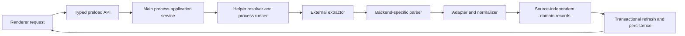

# Extractors and normalization

Pure backend adapters, a source-independent observation contract, sanitized fixtures, and command-spec builders are implemented in [ADR 0003](decisions/0003-extractor-observations-and-normalization.md). Normalized fixture ingestion into SQLite is implemented in [ADR 0004](decisions/0004-durable-observation-merge.md). Production process execution, acquisition/refresh orchestration and renderer acquisition remain targets. Start with [How it works](HOW_IT_WORKS.md); the surrounding process boundary is described in [Architecture](ARCHITECTURE.md).

## Supported acquisition targets

| Content | Initial backend | Initial product scope |
| --- | --- | --- |
| YouTube video discussion | `yt-dlp` | Acquire and refresh a video's discussion. |
| YouTube Community Post | `post-archiver-improved` | Acquire and refresh a public individual post URL. |

Channel-wide Community Post browsing, authenticated access, and member-only content are later possibilities, not requirements for the initial implementation. Posting, replying, likes, subscriptions, and account integration are outside the [product scope](PRODUCT_REQUIREMENTS.md).

The investigated contracts are yt-dlp **2026.08.19** and post-archiver-improved **0.4.0**, executable `post-archiver` (upstream sadadYes/post-archiver-improved v0.4.0). The parsers intentionally accept these versions only. Neither ordinarily proves complete coverage. Future helper versions require fixture validation rather than assumed compatibility.

## Implemented pure boundary

| Module | Implemented responsibility |
| --- | --- |
| `src/domain/extraction-observation.ts` | Remote item/comment fields, source identity, field authority, publication precision, direct-parent versus thread containment, collection availability, coverage, provenance and issues. No local seen/discovery state or persistence DTOs. |
| `src/main/extractors/yt-dlp.ts` | Parse single-video JSON, validate required IDs/text/collection structure, normalize root/direct-parent evidence and optional metadata. |
| `src/main/extractors/community.ts` | Parse flattened archive JSON containing exactly one post; validate post/comment/reply shape and preserve nested thread containment. |
| `src/main/extractors/invocation.ts` | Pure structured command descriptions, never process spawning or resolution. |
| `src/main/extractors/__fixtures__` | Eleven deterministic saved examples with per-file provenance; [matrix and sanitization details](../src/main/extractors/__fixtures__/README.md). |

Raw fields are read only inside the explicit adapters. Input is JSON text; adapters decode privately and never mutate caller data. Invalid required structure yields failed/unusable with no published item. Invalid optional metadata yields an unknown field and structured warning. Duplicates retain all candidates with occurrence diagnostics; missing/cyclic references are reported without repair. These candidate batches are not guaranteed complete stored trees, and must not be passed directly to the existing strict reader tree builder. ADR 0004 skips ambiguous identity occurrences, safely ingests independent candidates and preserves unresolved/cyclic relationship truth with a safe reader projection.

yt-dlp preserves opaque IDs verbatim; literal parent `root` is top-level and other observed parent IDs are direct. Integer comment timestamps are coarse estimates; `_time_text` preserves the label evidence, and absent timestamps stay absent. Valid optional likes and explicit pin/creator booleans are observations, including zero/false. Post-fetch `comment_count` is not an authoritative remote total. Null/omitted comments are unavailable; a present empty array is distinct. Disabled status requires external evidence.

Community `post_id` and comment IDs remain opaque. Replies in the nested archive prove thread/root containment, including under deeper nested test shapes; the verified format cannot prove their direct parent. Its `""`, `"0"`, false estimation flags and empty attachment lists cannot clear useful stored fields. Pinning/counts are unreliable; favorite/member/verified flags do not prove creator identity. Relative timestamps remain labels, never clock-derived instants. Images and links map to remote observations without local download paths or UI loading policy. No poll contract is introduced.

Both adapters derive canonical YouTube item URLs explicitly from their source item ID, percent-encoding the ID as a query value/path segment. Author handles derive only from explicit HTTPS YouTube `/@handle` author URLs. Names never become identities. These adapter rules do not finalize all future URL input validation or database constraints.

Command specs ignore config/plugins, disable playlists/media download, enable comments, request single JSON and require explicit finite retry/timeout inputs for yt-dlp. They use no unavailable-format tolerance flags. Community requires an individual post URL, comments, explicit output/config locations and comment/reply limits, with child-only `PYTHONUTF8=1` / `PYTHONIOENCODING=utf-8`; broken `--quiet` is omitted. Builders neither create config files nor decide helper path precedence, overall process deadlines or distribution.

## Boundary and responsibilities

Only the Electron main process may invoke external extractors. The renderer requests a domain operation such as acquiring or refreshing a content item through the typed API. It does not receive a command runner, filesystem access, shell fragments, raw backend types, or arbitrary process arguments. Database work may use an internal worker owned by the main-side backend without changing this boundary or giving that worker responsibility for extractor invocation. See [Electron boundaries](ARCHITECTURE.md) and [packaging security checks](PACKAGING.md).

The responsibilities below describe the target design; exact TypeScript interfaces and module paths remain implementation decisions.

| Component | Owns | Must not own |
| --- | --- | --- |
| Acquisition service | Validate the requested content target, coordinate extraction, normalization, and refresh reporting. | Rendering or comment seen-state policy inside backend code. |
| Helper resolver | Locate a usable helper for the selected backend and report its identity/version when available. | Hardcoded assumptions that development paths exist on another machine. |
| Process runner | Launch an explicit executable with structured arguments; capture completion, diagnostics, and cancellation/failure information. | Renderer-supplied executable paths or shell command text. |
| Backend parser | Decode and validate that backend's output. | Application domain types that expose backend-specific field names. |
| Adapter/normalizer | Map IDs, parent relationships, author/text/metadata, and evidence about extraction quality into the domain. | Overwrite local seen state or infer deletion from absence. |
| Refresh service | Apply the merge policy and persist the result atomically. | Assume that process success means a complete discussion was returned. |

Remote text, links, and diagnostics are untrusted input. They must remain data across parsing, persistence, IPC, and rendering. In particular, remote comment text must not become executable HTML. Diagnostic storage and user-facing error presentation must not weaken the [security boundary](ARCHITECTURE.md).

## Normalized output

Adapters must return source-independent data as defined by the [domain model](DOMAIN_MODEL.md). Conceptually, a normalized result needs:

- The content item's source, kind, stable source identity, and canonical/permalink information where available.
- Stable source comment IDs and parent relationships sufficient to reconstruct the observed discussion tree.
- Original comment text and available author identity, display name, handle, publication time, likes, pinned state, and creator/uploader information.
- Evidence about the extraction attempt: backend identity/version where obtainable, when it ran, diagnostics, and whether the result is known to be complete, partial, failed, or of unknown completeness.
- Enough information to distinguish a field that was supplied from a field that is unavailable, so absent optional metadata does not accidentally erase a previously useful value.

The observation shape is now explicit in `src/domain/extraction-observation.ts`. `ObservedField<T>` carries an observed value or unknown with an unavailable/lossy-default/unreliable/invalid/unsupported reason. Only trustworthy observed values, including meaningful empty/zero/false where supported, can authorize later remote updates. Do not invent timestamps, authors, parent records, or metadata. Source identity uses content kind/item/comment IDs independently of the executable. Observation diagnostics feed ADR 0004's item-scoped uniqueness, duplicate skipping and source-truth-preserving reader projection; no source tree repair is performed.

The adapter does not determine whether a comment is unseen or visually NEW. The merge service recognizes an existing comment by stable source identity, preserves its local state, and inserts a newly discovered comment as unseen. The first successful acquisition establishes the baseline: its comments have `firstDiscoveredAt` and start unseen, but do not receive visual NEW indicators. Comments first discovered by later refreshes are eligible for NEW independently of `publishedAt`; the indicator's lifetime remains unresolved. The adapter also does not decide that a comment missing from output has been deleted. See [Seen state](SEEN_STATE.md) and [Refresh and merge](REFRESH_AND_MERGE.md).

## Failure, partial output, and cancellation

Process failure, malformed output, unsupported output versions, cancellation, and interrupted acquisition must be represented explicitly. Previously valid stored content must survive these outcomes. A zero exit status alone is not sufficient evidence that every comment was returned.

Do not stream partially parsed records directly into stored data. Valid partial/unknown observations are accepted as observational input for a later non-destructive transactional merge; missing records have no deletion meaning and unknown fields cannot clear existing values. Ordinary successful output stays unknown even if counts match. Known truncation/limits require specific capture/runner evidence outside JSON; current adapters never emit complete. Failed refreshes must not publish success. ADR 0004 implements conflict skipping, accepted partial/unknown baselines and durable history. Future reporting/view UI remains open. See [refresh and merge](REFRESH_AND_MERGE.md).

Record useful diagnostics without presenting raw backend terminology as the only explanation to the user. Application context and recovery messages must be localized; raw extractor messages may be retained for diagnosis. See [Localization and theming](LOCALIZATION_AND_THEMING.md).

## Finding and distributing helpers

Windows is the initial development and packaging target. During development, a resolver may locate helpers through `PATH`. The design must also permit app-local or bundled helpers later and leave room for future Linux/macOS support without requiring those platforms initially. Keep helper resolution separate from backend invocation and normalization so packaging can change without rewriting domain logic.

The following are unresolved: which helper versions to support, Windows distribution artifacts and architecture support, runtime dependencies, resolver precedence, whether a user-configured helper path is needed, update ownership, and offline failure/retry behavior. Future Linux/macOS artifacts need their own decisions if those platforms are added. A helper found on `PATH` is not proof that it is a supported or compatible version. Product-facing diagnostics should explain a missing or incompatible helper without requiring renderer access to process execution.

Bundling requires checking the actual redistribution licenses and obligations for selected artifacts and their dependencies. This document does not assume that the application's own license settles helper redistribution. Distribution, signing, integrity, and update choices belong in [Packaging](PACKAGING.md) and, when decided, small [ADRs](decisions/README.md).

## Verification and open decisions

Adapter tests should use saved representative output fixtures, including unavailable metadata, malformed records, unexpected parent order, and partial output. Tests must prove that backend-specific types stop at the adapter boundary. Normal CI must not require network access or an installed extractor. Optional live checks are a separate suite; see [Testing](TESTING.md).

This pure milestone settles observation types, investigated versions/invocation intent, unknown/partial evidence and fixture provenance in [ADR 0003](decisions/0003-extractor-observations-and-normalization.md). ADR 0004 implements normalized ingestion, identity/conflict/relationship policy and baseline/history. Before live execution, resolve resolver/version checks, safe config/output lifecycle, process failure/limits, timeouts/cancellation/concurrency and process diagnostic retention. Do not silently turn one backend's incidental behavior into a product guarantee.
