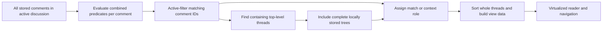

# Filtering and search

Active-discussion content/author/direct-parent-author search, All/Unseen/Seen, stable session applied results and navigation are implemented in [ADR 0008](decisions/0008-active-discussion-applied-queries.md). ADR 0010 implements presentation virtualization without changing query semantics. [ADR 0011](decisions/0011-virtualized-overview-and-durable-new.md) implements the applied-view ruler and durable NEW. [ADR 0012](decisions/0012-publication-date-and-latest-discovery-filters.md) implements publication-date and latest-refresh discovery filters. Sorting and bulk actions remain targets. The [product requirements](PRODUCT_REQUIREMENTS.md) establish the scope, [seen state](SEEN_STATE.md) defines local user state, and [UI and navigation](UI_AND_NAVIGATION.md) explains how results are read. Unresolved choices are also tracked in the [decision register](decisions/README.md).

## A match belongs to a comment; context belongs to its conversation

A filter predicate evaluates an individual comment. If any comment matches, display its complete containing top-level conversation tree, including the root and all locally known descendants. This includes siblings that do not match. It is not sufficient to show only the matching comment and its ancestor path.

For one applied query, keep these concepts separate:

| Concept | Meaning |
| --- | --- |
| Raw search matches | Comments that satisfy the search expression before other active filters are applied. |
| Active-filter matching comments | Comments that satisfy the complete combined predicate in the last applied evaluation. These are the actual matches used for counts, matching-only bulk actions, and match navigation. |
| Containing threads | Distinct top-level conversation trees containing at least one match. |
| Visible comments | All comments in those containing trees, subject to the presentation of collapsed replies. |
| Context comments | Comments included for conversation context that did not satisfy the combined predicate in the last applied evaluation. A context comment may still be a raw search match. |

The UI must distinguish active-filter matches from context and must not conflate raw search hits with active-filter matches. Visibility alone never makes a comment a match. Collapsing replies or virtualizing off-screen rows must not change the result counts or actual matching set.

Show both the matching-comment count and the containing-thread count. Do not present the total number of context rows as a match count. A containing-thread count is a derived query result, not persistent thread-level seen state.

For example, a stored conversation has a seen root, two seen replies, and one newly discovered unseen reply. With **Unseen only**, the result contains one matching comment and one containing thread. The reader includes the entire conversation, visibly identifies the unseen reply as the match, and identifies the other three comments as context. A bulk action on matches affects only the unseen reply. See the [tree model](DOMAIN_MODEL.md) for parentage and the [refresh rules](REFRESH_AND_MERGE.md) for discovery.

This rule applies consistently to unseen status, publication dates, comment text, author, replied-to author, and other applicable comment filters.

## Combining filters

Independent active filters normally combine with AND on the **same comment**. For example, `unseen AND author = Alice AND contents contain "camera"` matches Alice's unseen comments containing that text. An unseen reply by Bob and a separate matching-text comment by Alice do not jointly satisfy the predicate merely because they share a thread.

For example, if both a seen root and its unseen reply contain "camera", they are both raw search matches. With **Unseen only AND contents contain "camera"**, only the reply is an active-filter match. The root remains visible as context. A matching-only bulk action or next-match action must not treat the root as an active-filter match merely because its text contains the search term.

A top-level-thread-author filter is a deliberate relationship predicate: it examines a comment's containing thread author while still deciding whether that individual comment matches. A direct-replied-to-author filter examines the direct parent relationship, not every ancestor or an inferred `@mention` in the text. The [domain model](DOMAIN_MODEL.md) must preserve these relationships where the source provides them. Unavailable parent/author evidence does not match. Only resolved direct-parent application IDs provide that author; containment, missing/cyclic links and text mentions do not.

One search expression ORs its selected contents, own-author displayName/handle and direct-parent-author displayName/handle fields. The search clause ANDs with All/Unseen/Seen, publication and discovery on the same comment. Empty text imposes no search restriction and disables raw-search presentation; nonempty text with no fields is invalid. Opaque author IDs and top-level-thread-author search are excluded.

## Search the stored data

Initial search and filtering operate on the active discussion: all locally stored comments for the active video or Community Post, including comments not rendered or currently collapsed. They must not search DOM nodes, use browser Ctrl+F as the search engine, or limit results to previously rendered pages. Application-wide search across discussions is a possible later feature, not part of the initial scope.

The initial product must support:

| Search target or mode | Required behavior |
| --- | --- |
| Comment contents | Search the original stored content. |
| Comment author | Support author/display name/handle information where available. |
| Direct replied-to author | Search the author of the direct parent comment when known. |
| Ordinary text | Provide substring/text search without requiring regex syntax. |
| Regular expression | An explicit opt-in mode; ordinary text must not accidentally become a regex. |
| Case sensitivity | Provide sensitive and insensitive modes. |

Top-level-thread-author search is an optional useful extension. It must use the relationship predicate described above if added; it is not required to deliver the initial core search modes.

Changing the interface language must not change the content searched or search results. Search rules must be defined independently of the UI locale; see [localization](LOCALIZATION_AND_THEMING.md). Ordinary text uses substring comparison after NFC normalization of pattern and target. Case-sensitive compares directly; insensitive uses deterministic JavaScript toLowerCase() on both NFC strings. Diacritics remain significant; no locale lowercase, accent stripping, tokenization, stemming or fuzzy comparison. Regex is ECMAScript pattern-only with application-owned u/iu flags and NFC on both strings; no implicit g/m/s or slash-delimited flag parsing.

The UI must make the active-discussion scope understandable. Other filters narrow the active-filter matching set without narrowing the underlying dataset searched. Keep raw search-match information separate where needed for text highlighting or a search-specific control, and do not use it as the combined-filter result.

### Invalid and expensive expressions

Validate a regular expression before evaluating a query. Invalid syntax must produce a clear, localized validation error. It must not crash the application or silently masquerade as a successful zero-match result. Preserve the distinction between invalid input and a valid query with no matches. The previous successful applied view remains displayed on invalid syntax, missing fields, execution failure or timeout.

Valid expressions can also be expensive on large inputs. All production comparison queries execute in a dedicated renderer Web Worker over a narrow application-owned projection. A 1000 ms whole-query deadline terminates the worker and reports a localized QUERY_TOO_EXPENSIVE view error. New Apply supersedes pending work; the next evaluation recreates a terminated worker. Complete results only: comments are never truncated and partial/late replies are rejected. Pure rules remain independently testable. See ADR 0008.

## Publication dates and time (ADR 0012)

Publication filtering uses each comment's OWN best-available stored `publishedAt`
instant. No parent/root/item/discovery/last-observed inheritance or relative-label
parsing is permitted. Missing, invalid or label-only publication evidence does not
match an active date predicate. Without a date restriction it participates normally.
Estimated/coarse source instants participate by ordinary comparisons; metadata is
preserved, and compact localized help explains that membership uses an estimate.
No source timestamp is repaired by filtering.

Calendar dates are validated Gregorian ISO `YYYY-MM-DD`, separate from instants.
Use the computer's CURRENT system IANA zone at evaluation, never the UI locale,
a fixed offset, assumed UTC or a hardcoded country. Custom From includes local
start of day; To includes its entire local day through the EXCLUSIVE start of the
next local calendar day: `[From start, day-after-To start)`. Either can be omitted.
Same-day ranges work across 23/25-hour DST days. From after To or malformed dates
produce localized errors while retaining the old applied result.

| Publication mode | Resolved predicate |
| --- | --- |
| Custom / no preset | Optional From/To; both absent means no publication restriction |
| Today | `[local start today, local start tomorrow)` |
| Last 24 hours | `[captured now - 24h, captured now]` |
| Last 7 days | `[captured now - 168h, captured now]`; rolling duration, not calendar week |

Presets replace custom bounds and disable their inputs. Changing modes clears
custom dates. Today may include a malformed future instant later today; rolling
ranges naturally exclude times after now. No special future-source rule is added.

Resolve semantic criteria ONCE using one injected/captured evaluation clock and
system zone, before worker dispatch. The worker only compares deterministic numeric
bounds/instants. Apply promotes captured draft criteria only on successful evaluation.
Wall time or OS-zone changes alone never alter the applied view or add a stale
indicator. Successful explicit Refresh reevaluates the LAST APPLIED semantic
criteria against fresh now/zone; draft dates/discovery/search remain draft. Failed
Refresh/evaluation preserves the prior applied result.

### Latest discoveries

The independent discovery selector is All discoveries or NEW from latest refresh.
NEW matches exactly `isNewDiscovery`: the current durable latest accepted
post-baseline first-discovery cohort under ADR 0011. Baseline and prior cohorts
fail; seen NEW and old-published newly discovered comments match. Failed attempts
preserve it; accepted partial/unknown or zero-insert attempts replace it, possibly
with zero matches. No arbitrary historical window, app-start/open/seen boundary,
manual dismissal or second SQLite NEW state is added.

Search AND seen AND publication AND discovery must all hold on the SAME comment.
Predicates satisfied by different comments in a tree never jointly match. Complete
containing-tree context and separate raw-search hits remain unchanged. The ruler's
MATCH lane uses this combined applied set; its NEW lane remains independent over
all displayed matches/context. Navigation uses those same application IDs.

Future date-based bulk operations MUST reuse `resolvePublication` and
`publicationMatches` with these exact timezone, boundary, clock and evidence rules,
rather than creating a second date model. Bulk actions and undo remain future work.
Q-03 is closed; Q-05 now covers only future arbitrary historical discovery windows.

## Keep the reader stable while seen state changes

Persist a manual seen edit immediately, while retaining the displayed result membership and ordering. Otherwise, marking an unseen reply seen could remove its entire conversation during reading. The logical active-filter matching set, match/context classification, and matching-comment/containing-thread counts belong to the last applied evaluation until the view is recomputed.

Keep that applied result alongside live seen state. A comment can therefore have a checked seen checkbox while remaining an active-filter match from the last applied **Unseen only** query. MATCH/CONTEXT and raw-only SEARCH HIT badges are distinct from live unseen tint/checkbox and neutral rails. A saved-seen Apply indication appears only when applied seen is not All; draft difference is a separate indication. Such indicators must not replace the applied matching set/count with a fresh query or imply that saving the checkbox is deferred.

An **Apply changes / Update view** action recomputes the result using already-persisted state. It is not a save button and does not fetch remote data. Ctrl+Enter applies while a discussion is active; Enter in the search form also applies. Controls edit draft only, and success promotes the captured criteria/result. Each discussion has independent session state retained across close/reopen and cleared on Library removal; restart resets it.

This stability guarantee concerns incidental changes caused by seen edits. Explicit changes to filters, searches, or sorting are intentional view changes; controls wait for explicit Apply. A successful explicit **Refresh** automatically recomputes the active view after its remote data has been merged, using last applied criteria and preserving draft; successful evaluation clears the saved-seen stale condition unless a newer seen save occurred during evaluation. Failed reevaluation retains the old result and surfaces an error. Remote refresh remains a separate operation described in [refresh and merge](REFRESH_AND_MERGE.md). Failed refreshes retain the prior result. Accepted partial/unknown refreshes reevaluate applied criteria while honestly reporting limited coverage; they replace the NEW cohort.

### Bulk scope is never inferred from visible rows

Bulk **mark matching comments seen/unseen** must target the last applied active-filter matching comment IDs. Context comments must never be included simply because the reader displays them; raw search matches are not sufficient either. The operation must not query mounted DOM elements to determine its targets or silently reevaluate the predicate first.

When seen edits are awaiting view recomputation, matching-only bulk actions continue to use that last applied set until Apply or a successful explicit Refresh recomputes the active view. The UI must explain the applied scope and count. **All comments** and date-based bulk operations are also scoped to the active discussion; “all” does not mean every discussion in the database. Undo/recoverability is discussed in [seen state](SEEN_STATE.md).

## Data and performance design

[ADR 0010](decisions/0010-variable-height-discussion-virtualization.md) implements
presentation virtualization only. Pure rows join live comments to frozen applied
preorder/parents, preserving every containing-tree sibling and role. The mounted
slice never defines raw/active IDs, match/thread counts, live unseen candidates or
Ctrl+click descendants. The worker still receives all stored active-discussion
comments, including unmounted ones, under the same 1000 ms deadline.

Successful explicit Apply reveals the first active restrictive match or start for
unrestricted/empty results. Successful Refresh preserves the visible data anchor
when retained and keeps draft. Seen acknowledgments only update live visuals;
an applied Unseen match remains until another successful evaluation. No FTS,
global search, database paging or changed comparison/context semantics is added.

The architectural target is a query result expressed as data: matching IDs, containing-thread IDs, comment relationships, presentation order, and the information needed to distinguish context. DiscussionQuery and DiscussionViewResult in src/domain/discussion-query.ts define criteria, raw/active/root IDs, complete visible preorder, frozen placement, ordered match IDs, counts and restrictive/search-active flags.

Use this data for counts, bulk target selection, unseen/match navigation, and [overview-ruler markers](UI_AND_NAVIGATION.md). Next/previous match navigation uses the current applied active-filter matches. Any separately labeled search-specific navigation must respect the applicable view and distinguish raw search hits from active-filter matches. Virtualization determines which rows exist in the DOM; it does not determine query results. Sorting primarily rearranges whole top-level conversations and must keep replies attached to their parent tree. Exact sort modes, defaults, tie-breaking, and reply ordering remain unresolved.

ADR 0008 selects the bounded renderer worker/in-memory evaluator for the existing full bootstrap architecture. SQLite query planning, indexes, FTS and larger-data batching remain future decisions. Ordinary substring and regex requirements still apply if an index is introduced; token-based full-text search must not silently replace substring semantics. See [database planning](DATABASE.md) and [architecture](ARCHITECTURE.md).

## Verification

The deterministic suite must exercise whole-tree context, sibling inclusion, raw-search/active-filter/context distinctions, counts independent of collapsed/rendered rows, AND on one comment, initial search fields and modes, regex validation, combined filters, publication-date boundaries, and stable displayed membership/order after seen edits. It must verify active-discussion scope, last-applied matching targets/counts until recomputation, automatic active-view recomputation after a successful explicit Refresh, matching-only bulk actions excluding context comments, and sorting that preserves conversations. Concrete test strategy belongs in [testing](TESTING.md).

## Ruler matches are applied active-filter matches

ADR 0011 scopes all categories to the currently displayed applied virtual preorder. Match markers appear only for restrictive applied active-match IDs; identity candidates in an unrestricted view create no match lane. A raw text hit that fails Unseen may remain SEARCH HIT context, but has no match marker. Live unseen context still receives an unseen marker, and displayed NEW context receives NEW independently.

Seen saves update unseen immediately while preserving the applied match lane until successful Apply or Refresh reevaluation. Apply changes displayed NEW marker scope, never discovery identity. NEW, match and unseen overlap in separate lanes and counts; excluded trees have no markers.
