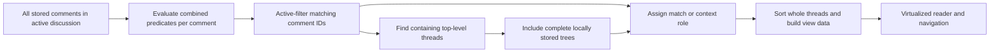

# Filtering and search

This document defines the target behavior; it does not describe features already implemented in the Electron scaffold. The [product requirements](PRODUCT_REQUIREMENTS.md) establish the scope, [seen state](SEEN_STATE.md) defines local user state, and [UI and navigation](UI_AND_NAVIGATION.md) explains how results are read. Unresolved choices are also tracked in the [decision register](decisions/README.md).

## A match belongs to a comment; context belongs to its conversation

A filter predicate evaluates an individual comment. If any comment matches, display its complete containing top-level conversation tree, including the root and all locally known descendants. This includes siblings that do not match. It is not sufficient to show only the matching comment and its ancestor path.

For one applied query, keep these concepts separate:

| Concept | Meaning |
| --- | --- |
| Raw search matches | Comments that satisfy the search expression before other active filters are applied. |
| Active-filter matching comments | Comments that satisfy the complete combined predicate in the last applied evaluation. These are the actual matches used for counts, matching-only bulk actions, and match navigation. |
| Containing threads | Distinct top-level conversation trees containing at least one match. |
| Visible comments | All comments in those containing trees, subject to the presentation of collapsed replies. |
| Context comments | Comments included for conversation context that did not satisfy the combined predicate in the last applied evaluation. A context comment may still be a raw search match. |

The UI must distinguish active-filter matches from context and must not conflate raw search hits with active-filter matches. Visibility alone never makes a comment a match. Collapsing replies or virtualizing off-screen rows must not change the result counts or actual matching set.

Show both the matching-comment count and the containing-thread count. Do not present the total number of context rows as a match count. A containing-thread count is a derived query result, not persistent thread-level seen state.

For example, a stored conversation has a seen root, two seen replies, and one newly discovered unseen reply. With **Unseen only**, the result contains one matching comment and one containing thread. The reader includes the entire conversation, visibly identifies the unseen reply as the match, and identifies the other three comments as context. A bulk action on matches affects only the unseen reply. See the [tree model](DOMAIN_MODEL.md) for parentage and the [refresh rules](REFRESH_AND_MERGE.md) for discovery.

This rule applies consistently to unseen status, publication dates, comment text, author, replied-to author, and other applicable comment filters.

## Combining filters

Independent active filters normally combine with AND on the **same comment**. For example, `unseen AND author = Alice AND contents contain "camera"` matches Alice's unseen comments containing that text. An unseen reply by Bob and a separate matching-text comment by Alice do not jointly satisfy the predicate merely because they share a thread.

For example, if both a seen root and its unseen reply contain "camera", they are both raw search matches. With **Unseen only AND contents contain "camera"**, only the reply is an active-filter match. The root remains visible as context. A matching-only bulk action or next-match action must not treat the root as an active-filter match merely because its text contains the search term.

A top-level-thread-author filter is a deliberate relationship predicate: it examines a comment's containing thread author while still deciding whether that individual comment matches. A direct-replied-to-author filter examines the direct parent relationship, not every ancestor or an inferred `@mention` in the text. The [domain model](DOMAIN_MODEL.md) must preserve these relationships where the source provides them. Behavior when parent/author information is unavailable must be specified before implementation; do not manufacture a parent from text.

How a search box combines multiple selected fields, whether multiple values within one filter use OR, and the exact query controls are unresolved. The documented normal AND rule must remain predictable across filters.

## Search the stored data

Initial search and filtering operate on the active discussion: all locally stored comments for the active video or Community Post, including comments not rendered or currently collapsed. They must not search DOM nodes, use browser Ctrl+F as the search engine, or limit results to previously rendered pages. Application-wide search across discussions is a possible later feature, not part of the initial scope.

The initial product must support:

| Search target or mode | Required behavior |
| --- | --- |
| Comment contents | Search the original stored content. |
| Comment author | Support author/display name/handle information where available. |
| Direct replied-to author | Search the author of the direct parent comment when known. |
| Ordinary text | Provide substring/text search without requiring regex syntax. |
| Regular expression | An explicit opt-in mode; ordinary text must not accidentally become a regex. |
| Case sensitivity | Provide sensitive and insensitive modes. |

Top-level-thread-author search is an optional useful extension. It must use the relationship predicate described above if added; it is not required to deliver the initial core search modes.

Changing the interface language must not change the content searched or search results. Search rules must be defined independently of the UI locale; see [localization](LOCALIZATION_AND_THEMING.md). The exact Unicode normalization, diacritic handling, case-folding behavior, text representation, and regex dialect remain decisions to make and test. Do not silently equate locale-aware display formatting with a search comparison rule.

The UI must make the active-discussion scope understandable. Other filters narrow the active-filter matching set without narrowing the underlying dataset searched. Keep raw search-match information separate where needed for text highlighting or a search-specific control, and do not use it as the combined-filter result.

### Invalid and expensive expressions

Validate a regular expression before evaluating a query. Invalid syntax must produce a clear, localized validation error. It must not crash the application or silently masquerade as a successful zero-match result. Preserve the distinction between invalid input and a valid query with no matches. Whether the reader retains the previous valid result while showing the error is a UX decision still to be made.

Valid expressions can also be expensive on large inputs. The execution strategy, supported regex syntax, cancellation, and any resource limits are unresolved engineering choices. Select an approach that keeps input and navigation responsive; do not assume that moving a synchronous regex to the renderer satisfies the performance requirement. Surface any eventual limit explicitly rather than silently returning incomplete matches.

## Publication dates and time

Publication-date filters evaluate each comment's own `publishedAt`. A reply does not inherit the date of its root. Discovery time is a separate field and must not silently substitute for an unavailable publication time.

Support from/to ranges and useful presets. The following are examples to consider, not a fixed mandatory list:

| Preset | Meaning and decision still needed |
| --- | --- |
| Today | A calendar-day filter; the governing time zone and day boundary must be defined. |
| Last 24 hours | A recent-time filter; exact evaluation instant and endpoint inclusion must be defined. |
| Last 7 days | Requires a choice between a rolling duration and calendar-day interpretation. |

Do not offer an ambiguous **Since last refresh** publication-date preset as a substitute for discovery filtering. **New since refresh** concerns `firstDiscoveredAt` and refresh history, not `publishedAt`: a newly discovered comment may have been published long ago. Discovery controls must identify the relevant refresh boundary explicitly. The exact discovery-window selection and new-marker lifetime remain unresolved; see [refresh and merge](REFRESH_AND_MERGE.md).

Resolve inclusive/exclusive endpoints, time-zone behavior, missing/imprecise timestamps, and relative-preset evaluation time before implementing date predicates. The wording of a preset must match its actual predicate. Tests must cover boundaries and daylight-saving transitions where relevant. Locale controls date presentation, not the identity of stored instants; see [localization](LOCALIZATION_AND_THEMING.md).

The same timestamp rules must be shared with [date-based bulk seen operations](SEEN_STATE.md), which affect only comments whose own timestamps match and never implicitly include their ancestors or descendants.

## Keep the reader stable while seen state changes

Persist a manual seen edit immediately, while retaining the displayed result membership and ordering. Otherwise, marking an unseen reply seen could remove its entire conversation during reading. The logical active-filter matching set, match/context classification, and matching-comment/containing-thread counts belong to the last applied evaluation until the view is recomputed.

Keep that applied result alongside live seen state. A comment can therefore have a checked seen checkbox while remaining an active-filter match from the last applied **Unseen only** query. Exact styling, pending-view wording, and any supplementary live indicators remain design choices. Such indicators must not replace the applied matching set/count with a fresh query or imply that saving the checkbox is deferred.

An **Apply changes / Update view** action recomputes the result using already-persisted state. It is not a save button and does not fetch remote data. Ctrl+Enter is the likely shortcut, pending the formal keyboard policy. An indicator that the view is awaiting recomputation is a proposed way to explain this state.

This stability guarantee concerns incidental changes caused by seen edits. Explicit changes to filters, searches, or sorting are intentional view changes; whether those controls apply immediately, debounce, or wait for the same action remains unresolved. A successful explicit **Refresh** automatically recomputes the active view after its remote data has been merged; the user does not need to press Apply afterward. Remote refresh remains a separate operation described in [refresh and merge](REFRESH_AND_MERGE.md). Failed or partial refreshes must not be presented as successful completed refreshes.

### Bulk scope is never inferred from visible rows

Bulk **mark matching comments seen/unseen** must target the last applied active-filter matching comment IDs. Context comments must never be included simply because the reader displays them; raw search matches are not sufficient either. The operation must not query mounted DOM elements to determine its targets or silently reevaluate the predicate first.

When seen edits are awaiting view recomputation, matching-only bulk actions continue to use that last applied set until Apply or a successful explicit Refresh recomputes the active view. The UI must explain the applied scope and count. **All comments** and date-based bulk operations are also scoped to the active discussion; “all” does not mean every discussion in the database. Undo/recoverability is discussed in [seen state](SEEN_STATE.md).

## Data and performance design

The architectural target is a query result expressed as data: matching IDs, containing-thread IDs, comment relationships, presentation order, and the information needed to distinguish context. These are conceptual responsibilities, not a committed TypeScript interface or SQL schema.

Use this data for counts, bulk target selection, unseen/match navigation, and [overview-ruler markers](UI_AND_NAVIGATION.md). Next/previous match navigation uses the current applied active-filter matches. Any separately labeled search-specific navigation must respect the applicable view and distinguish raw search hits from active-filter matches. Virtualization determines which rows exist in the DOM; it does not determine query results. Sorting primarily rearranges whole top-level conversations and must keep replies attached to their parent tree. Exact sort modes, defaults, tie-breaking, and reply ordering remain unresolved.

SQLite query planning, indexes, any full-text search facility, worker placement, and the division between database and in-memory evaluation are implementation decisions. Ordinary substring and regex requirements still apply if an index is introduced; token-based full-text search must not silently replace substring semantics. See [database planning](DATABASE.md) and [architecture](ARCHITECTURE.md).

## Verification

The deterministic suite must exercise whole-tree context, sibling inclusion, raw-search/active-filter/context distinctions, counts independent of collapsed/rendered rows, AND on one comment, initial search fields and modes, regex validation, combined filters, publication-date boundaries, and stable displayed membership/order after seen edits. It must verify active-discussion scope, last-applied matching targets/counts until recomputation, automatic active-view recomputation after a successful explicit Refresh, matching-only bulk actions excluding context comments, and sorting that preserves conversations. Concrete test strategy belongs in [testing](TESTING.md).
