# How it works

This guide is for the technically capable project owner who wants to understand the whole application without having written each subsystem. It describes the **intended system**. Today the repository implements the synthetic reader with main-owned SQLite, durable manual seen state/preferences, migrations, isolated profiles, and a typed preload API. Live acquisition/refresh, compact unified workspace tabs and active-discussion search/seen filtering with stable session applied views/navigation are implemented. ADR 0010 implements bounded variable-height rendering with unmounted-target navigation. Dates, bulk recovery/actions, full persistent view restoration and the ruler below remain targets. Start with the [documentation map](README.md) for status or [product requirements](PRODUCT_REQUIREMENTS.md) for the full contract.

## The local library is the center

The application keeps discussions in SQLite so that reading, searching, and manually tracking processed comments do not depend on an open download session. A refresh adds observations to that library. It does not replace your reading history with whatever an extractor happened to return that time.

A **content item** is a video or a Community Post. Each item contains comments. A top-level comment and its replies form a **thread**. Every comment has its own seen/unseen value. A thread can have a computed unseen count, but it has no stored seen flag of its own. See [Domain model](DOMAIN_MODEL.md) and [Seen state](SEEN_STATE.md).

Initially, normal search/filtering and generic bulk actions work within the discussion in the active tab. "Complete local dataset" means all stored comments of that discussion, including collapsed and unrendered ones. Other discussions remain in the library, but library-wide search is a possible future feature. Initial development and packaging target Windows while allowing later Linux/macOS support.

```mermaid
flowchart LR
    URL[Video or public post URL] --> Main[Main-process acquisition service]
    Main --> Helper[Source-specific external helper]
    Helper --> Adapter[Adapter and normalizer]
    Adapter --> Model[Our discussion and comment model]
    Model --> Merge[Transactional merge]
    Merge --> DB[(SQLite library)]
    DB --> Query[Local query and conversation context]
    Query --> Bridge[Typed preload API]
    Bridge --> UI[Virtualized React reader]
```

## From a URL to stored comments

The user opens a supported item. React asks the main process to acquire it through a small typed API exposed by the preload script. React cannot run arbitrary commands or open the database. The main process identifies the source and uses the corresponding adapter: yt-dlp for a video, post-archiver-improved for an individual public Community Post.

The helper's output is not yet our application data. The adapter validates and converts it into our own identities, comment text, parent relationships, authors, and available metadata. A missing timestamp or author property must remain honestly missing. Neither the UI nor the domain rules should need to know how one helper happens to spell a field. This separation lets us change helper versions or replace a backend without rewriting the reader. See [Extractors](EXTRACTORS.md) and [Architecture](ARCHITECTURE.md).

Validated observations are merged into SQLite in a transaction. The first acquisition and later refreshes share the important preservation rules: new identities get unseen state; existing identities keep their local state. Refresh history records what happened. Pure helper command specifications and source field/coverage observations have offline fixtures (ADR 0003); normalized transactional ingestion/history is implemented in ADR 0004. Live execution and acquisition/refresh UI remain future work.

The first successful acquisition establishes the discussion's local baseline. Every imported comment gets `firstDiscoveredAt` and starts unseen, but the reader does not label thousands of baseline comments visually NEW. The same recorded discovery history can later distinguish comments first discovered by subsequent refreshes.

## Refresh adds knowledge without losing your work

Suppose you read a root comment and two replies yesterday and marked all three seen. Today a refresh finds an edited root, those replies, and a new reply. The application can update the root's text, keep the existing flags, and insert the new reply unseen. If a reply is absent from this extraction, absence alone does not remove it from the local library.

Three times answer different questions:

- **Published:** when YouTube says the comment was posted, if available.
- **First discovered:** when this library first learned about the comment, which may be much later than publication.
- **Last observed:** when an accepted extraction most recently included it.

"New" refers to discovery history, while "unseen" is your durable choice. Visual NEW is intended for discoveries after the initial successful baseline. An old discovered comment may stay unseen for months; a later newly discovered comment may immediately be marked seen. Editing an existing comment does not create a newly discovered identity. NEW-marker lifetime/removal remains [unresolved](decisions/README.md).

The helper runs before the final database merge, so a long network operation need not hold a database write transaction open. A failure cannot wipe out the last valid stored discussion. Valid partial/unknown batches can contribute safe additions/authoritative updates and establish the first baseline, retaining their true coverage. Ambiguous identities are skipped while independent observations remain eligible. See [Refresh and merge](REFRESH_AND_MERGE.md) for the sequence and failure rules.

## Matching a comment does not remove its conversation

Filters answer “which comments satisfy the complete applied filter set?” A **raw search match** satisfies the search predicate alone. An **active-filter match** satisfies the full combination at the applied view evaluation. A **context comment** is included for the conversation but does not satisfy that evaluation's full predicate. A text hit can therefore be context if it fails another active filter and a different comment in its thread satisfies the full set.

In the example above, Unseen only matches the single new reply. The visible tree still includes the root and all stored replies in that thread. The new reply is marked as a match; the rest are context. The counts are **one matching comment** and **one containing thread**, even though more comments are visible.

This rule also applies to dates, comment text, author, direct replied-to author, and other applicable filters. A bulk operation on matching comments acts on the last applied active-filter matching IDs, not every visible row. Otherwise, preserving context would accidentally expand the mutation scope. See [Filtering and search](FILTERING_AND_SEARCH.md).

## Saving a checkbox and updating a view are separate

When you click the new reply's checkbox, its seen value is saved immediately. The current filtered result stays in place so it does not disappear while you are reading. Apply changes / Update view recomputes the result from already-saved state. If no comment in that thread is still unseen, the thread leaves Unseen only at that point.

This creates two distinct kinds of state: durable comment state in SQLite, and the currently applied result set. A pending view change does **not** mean the checkbox is unsaved. Checkbox feedback must reflect successful persistence or clearly report an error. The applied active-filter matching set, its result counts, and displayed membership/order remain tied to that evaluation until recomputation. Matching bulk actions use those same IDs even after a seen edit; they do not run a fresh query first. Exact pending-view styling and restoration of pending result membership after restart remain open.

An ordinary click changes only its comment. Ctrl+click takes the clicked comment's resulting seen value and applies it to that comment and its descendants. It does not independently invert every reply. Generic Mark all means all comments in the active discussion, never the entire library. Date-based bulk actions instead test each comment's own publication time, without extending to parents or replies. Recoverability is required design work; its undo mechanism is still open. See [Seen state](SEEN_STATE.md).

Apply performs local view recomputation only. A successful explicit Refresh runs the helper, safely merges the observations, then automatically recomputes the active view. A new unseen reply can therefore appear immediately under Unseen without a second Apply action. That recomputation also incorporates seen edits already saved. Ctrl+Enter applies the discussion draft; source Refresh remains button-only, with Ctrl+R/F5 deliberately unbound. F1 opens the Settings keyboard reference, which also documents workspace cycling/close and contextual search/URL focus. See [current shortcuts](UI_AND_NAVIGATION.md#keyboard-shortcuts-and-discoverability). Partial/unknown batches are accepted non-destructively and retain their true coverage in history. The eventual refresh UI must report that coverage; its presentation details remain open.

## Searching and navigating a large discussion

Only the rows near the viewport need to exist as rendered UI elements. This is virtualization. The library still contains all comments, so the query engine and navigation can find comments that have never been mounted in the DOM.

Initial search must support comment contents, author/display name/handle, direct replied-to author, ordinary text matching, opt-in regex, and case-sensitive/insensitive operation. Top-level thread-author search may also be supported where useful. Search composes with other filters, normally with AND on the same comment. Invalid regex produces a validation error. Matching-comment and thread counts come from the applied active-filter result across all stored comments in the active discussion, not from counting HTML elements.

Publication-date ranges and useful presets such as Today or Last 24 hours test `publishedAt`; the preset list is not permanently fixed. "New since refresh" instead uses discovery/refresh history. A reply published months ago but discovered after the baseline can be new without passing a recent publication-date filter. The UI must not blur these concepts with a vague "Since last refresh" publication-date preset. Exact timestamps remain discoverable when available.

Next/previous match navigation in the filtered reader follows the currently applied active-filter matching set. Unseen and any search-specific navigation operate within the applicable view, with their remaining details documented separately. The required scrollbar-adjacent overview ruler represents at least unseen comments, search matches, and subsequent-refresh discoveries. Its clickable markers resolve comment identities from data. Geometry, overlap, collapsed-tree positioning, and marker lifetime remain open. Jumping cooperates with virtualization and never marks the target seen. See [UI and navigation](UI_AND_NAVIGATION.md) and [Architecture](ARCHITECTURE.md).

## Tabs restore your workspace

Each browser-like tab remembers its item, filters, search, sort, reply expansion, selected/navigation comment, and useful scroll position. These durable settings live in SQLite along with language and appearance preferences. Comments and their seen state are shared library data, while each tab has its own view. Exact policies for duplicate tabs, cross-tab update timing, and restoring a stale pending result are open.

English and Polish interface text uses stable translation keys. Dates, relative times, and numbers use locale-aware formatting. Changing the interface language does not translate comments or change search semantics. Appearance defaults to System, follows OS changes in that mode, and also offers explicit Light/Dark. Semantic tokens support switching without restarting. See [Localization and theming](LOCALIZATION_AND_THEMING.md).

## What protects the library as the application grows

The current SQLite foundation has transactional schema migration, isolated development/test profiles, and typed main-owned persistence. Backup/restore and export still need designed workflows before they can protect released data across upgrades. React reaches main through a narrow typed preload bridge and receives acknowledged snapshots; it cannot open SQLite. Main may later delegate database work to an internal worker without changing that boundary. Future extractors will also be invoked only by main. See [Database](DATABASE.md), [Architecture](ARCHITECTURE.md), and [Packaging](PACKAGING.md).

Deterministic tests exercise the rules above without live YouTube access. Saved helper fixtures test normalization; temporary databases test transactions and migrations. A small meaningful UI/E2E suite is expected later, focused on important workflows rather than an exhaustive UI matrix. Optional live smoke tests cannot replace deterministic checks. See [Testing](TESTING.md). Unsettled behavior and when it blocks implementation are collected in the [decision register](decisions/README.md).
