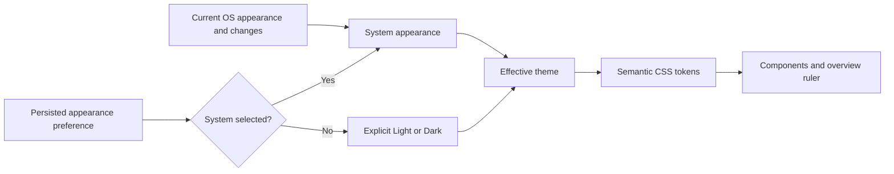

# Localization and theming

English and Polish UI localization and System/Light/Dark appearance are product requirements from the beginning. They are target capabilities, not features already present in the scaffold. This document describes their boundaries; [UI and navigation](UI_AND_NAVIGATION.md) describes the reader and [architecture](ARCHITECTURE.md) describes the process boundary.

## Interface language

Support at least English (`en`) and Polish (`pl`). Use stable, language-independent translation keys for user-facing application strings. Do not scatter English literals through React components and later treat them as the localization system.

On first run, use a supported operating-system locale where practical and otherwise fall back to English. Let the user explicitly select a language and persist that preference in the application's durable settings. Apply language changes without an application restart where practical. An explicit saved choice takes precedence over first-run detection.

Regional locale matching, whether a separate “follow system language” preference is offered, and how the language choice maps to a formatting locale remain unresolved. These details must be documented before implementation, particularly for regional date formats. The initial language set does not require automatic translation of remote content.

`i18next` with `react-i18next` is an acceptable candidate. It is not installed or selected by this documentation task. A materially simpler alternative can be chosen with an explanation of how it handles translation keys, interpolation, plurals, missing keys, and live updates. Record a significant choice in the [decision register](decisions/README.md).

### Translation boundaries

| Content | Treatment |
| --- | --- |
| Application labels, menus, tooltips, empty states, validation, and error context | Localize with stable keys. |
| Counts and sentences containing user/source values | Use translated templates with interpolation and appropriate plural forms. |
| Stored comment/post text, source titles, and author identities | Display original content; changing UI language does not translate it. |
| Raw extractor diagnostic messages | May remain in their original form, accompanied by localized user-facing context. |
| Stable IDs, enums, query values, and database fields | Remain language-independent. |

Avoid constructing sentences by concatenating translated fragments. English and Polish need room for different word order and plural forms. Keep source content distinct from application markup when inserting it into localized messages.

Typed errors crossing IPC should carry stable error codes and structured context where practical, so the UI can localize the explanation without using an English sentence as a protocol value. This is a proposed design approach; the exact error contract is unresolved. See [extractor diagnostics](EXTRACTORS.md) and [architecture](ARCHITECTURE.md).

## Format dates and numbers; preserve meaning

Use locale-aware `Intl` APIs for dates, numbers, and relative times. The reader should offer a relative publication timestamp and an exact timestamp on hover or in details where appropriate. Translate surrounding labels without rewriting the source timestamp or content.

Store time values in a language-independent representation as defined by the [database design](DATABASE.md). Locale and time zone are related presentation concerns but are not interchangeable: choosing Polish must not by itself redefine the time zone of a stored instant.

The governing time zone for display and date predicates, timestamp precision, relative-time update cadence, and exact timestamp presentation are unresolved. Publication-date filtering uses each comment's `publishedAt`; useful preset examples such as **Today**, **Last 24 hours**, and **Last 7 days** need explicit date rules if selected. They are examples, not a fixed mandatory list. **New since refresh** is a separate discovery-history concept, not a publication-date shortcut. See [filtering and search](FILTERING_AND_SEARCH.md). Formatting a boundary differently must not silently change the comments it selects, and exact timestamps must remain discoverable.

## Interface language must not change search

Search operates on original stored text and identities. Switching between English and Polish must not alter the same query's results. Define case sensitivity, Unicode comparison rules, normalization, and any regex behavior independently of the interface locale.

Localized labels may describe the same saved filter, but its persisted representation must use language-independent fields and values. Do not store the translated label “Unseen only” as the filter's identity. Similarly, do not use a locale-formatted timestamp string as the durable boundary of a date query. See [filtering and search](FILTERING_AND_SEARCH.md) and [tab persistence](UI_AND_NAVIGATION.md).

## Appearance preference and effective theme

Support these persisted preferences:

| Preference | Effective appearance |
| --- | --- |
| System | Follow the current operating-system appearance and subsequent changes. |
| Light | Use the application's light theme. |
| Dark | Use the application's dark theme. |

The preference and effective theme are different values. A user who chose System still prefers System when the OS switches from light to dark. Apply changes without an application restart.

**System is the first-run appearance default.** It follows the operating-system appearance until the user explicitly chooses Light or Dark. Windows is the initial supported target, as described in [packaging](PACKAGING.md).

Use semantic CSS theme variables/tokens across components. Examples of roles include application background, surface, primary text, secondary text, border, focus, selection, error, unseen marker, search-match marker, and new-comment marker. These are illustrative token roles, not a finalized token naming scheme or palette.

Do not scatter unrelated literal light/dark colors through components. Design and verify both themes, including hover, focus, disabled controls, context-only rows, matched text, pending-view indicators, and overview-ruler markers. A visual distinction must remain understandable when colors are hard to distinguish; color alone is insufficient for critical state.

How platform appearance changes reach the renderer is an implementation choice: a narrow typed platform API through preload or an appropriate browser appearance mechanism can be considered. Any main-process integration must respect the [typed preload boundary](ARCHITECTURE.md); appearance support does not authorize arbitrary renderer access to Node.js or OS APIs.

## Durable preferences and verification

Persist user language and appearance choices through application services and SQLite settings, consistently with the [database policy](DATABASE.md). Exact settings schema and migration strategy are not selected here. Development and tests must not write to the user's real preferences database.

The test plan should verify English and Polish key coverage, translated validation and error context, representative plural counts, first-run fallback, explicit preference persistence, live language updates where supported, original content remaining unchanged, and identical search results across interface languages. Use controlled locale, clock, and time-zone inputs for deterministic assertions.

Theme verification should cover System as the first-run default, explicit Light/Dark, System reacting to simulated OS appearance changes, preference surviving restart, and readable interactive states in both palettes. Later focused UI tests should check layout with longer translated strings and combined markers/highlights rather than relying only on translation-file completeness. See [testing](TESTING.md).

The translation library, formatting-locale policy, time-zone controls, missing-key fallback policy, palette, and platform-event implementation remain open. Resolve each when the relevant feature is implemented and record decisions where they affect multiple subsystems.
