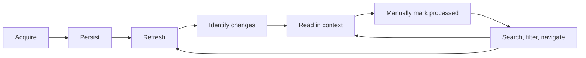

# Product requirements

Status: persistent target specification; the reader includes SQLite/typed-boundary persistence and durable normalized fixture merge/history. [Documentation map](README.md) · [Owner's walkthrough](HOW_IT_WORKS.md) · [Open decisions](decisions/README.md)

## Purpose and scope

Build an Electron + React + TypeScript desktop application for persistently reading and managing YouTube discussions. Its durable local library and manually maintained per-comment state make it an inbox/reader. The core loop is:

Initial sources are video discussions through **yt-dlp** and public individual Community Post URLs through **post-archiver-improved**. Both use isolated adapters and our source-independent [domain model](DOMAIN_MODEL.md). Channel-wide Community Post browsing and authenticated/member-only content are later possibilities, not initial requirements.

Windows is the initial development and packaging target. Avoid unnecessary barriers to future Linux/macOS support without requiring either for the first implementation or package. Normal search/filtering and generic bulk operations are scoped to the active discussion. Library-wide search is a possible future feature, outside the initial specification.

AI summarization, sentiment analysis, automatic translation, posting/replying to YouTube, likes/subscriptions as actions, account integration, and unrelated functionality are outside current scope. Displaying extracted like counts is within scope; interacting with YouTube accounts is not.

## Required behavior

The IDs below are stable reference labels for future implementation work and tests. They do not prescribe implementation order.

| ID | Requirement | Detailed contract |
| --- | --- | --- |
| SRC-1 | Support the two initial sources behind adapters; keep extractor formats out of React and domain types. | [Extractors](EXTRACTORS.md) |
| SEEN-1 | Persist seen/unseen on individual comments only; no stored thread-level seen state. | [Seen state](SEEN_STATE.md) |
| SEEN-2 | Viewing/scrolling/navigation do not change seen state. Checkbox toggles one comment; Ctrl+click applies its resulting state to it and all descendants. | [Seen state](SEEN_STATE.md) |
| REF-1 | Merge by stable source comment identity; preserve existing local state and insert new comments unseen. Eligible remote fields may update when newer valid information is available; no mutation is required for unchanged observations. | [Refresh and merge](REFRESH_AND_MERGE.md) |
| REF-2 | Absence from an extraction is not deletion. Failed/partial refreshes cannot destroy a valid local snapshot; related database changes are transactional. | [Refresh and merge](REFRESH_AND_MERGE.md) |
| REF-3 | Store publication time when available, first-discovered and last-observed information, and refresh history. Distinguish discovery/new from durable unseen. | [Domain model](DOMAIN_MODEL.md), [Database](DATABASE.md) |
| REF-4 | The first successful acquisition establishes a baseline: imported comments receive `firstDiscoveredAt` and start unseen, but do not get visual NEW markers. Subsequent refresh discoveries are eligible for NEW; lifetime/removal policy remains open. | [Refresh and merge](REFRESH_AND_MERGE.md), [Domain model](DOMAIN_MODEL.md) |
| VIEW-1 | Filters match individual comments. Distinguish raw search matches, active-filter matches, and context; include complete trees containing applied active-filter matches. | [Filtering and search](FILTERING_AND_SEARCH.md) |
| VIEW-2 | Seen edits save immediately without changing displayed membership/order or the applied matching set. Apply changes recomputes locally. Successful explicit remote Refresh acquires, safely merges, then automatically recomputes the active view. | [Filtering and search](FILTERING_AND_SEARCH.md), [UI](UI_AND_NAVIGATION.md) |
| SEARCH-1 | Initial search/filtering covers all locally stored comments of the active discussion, including collapsed, virtualized, and unrendered comments; not other stored discussions. | [Filtering and search](FILTERING_AND_SEARCH.md) |
| SEARCH-2 | Initial search must support contents, author/display name/handle, direct replied-to author, ordinary text matching, opt-in regex, and sensitive/insensitive case modes. Top-level thread-author search may also be supported where useful. | [Filtering and search](FILTERING_AND_SEARCH.md) |
| SEARCH-3 | Invalid regex produces a clear validation error. Search and filters normally combine with AND. Show applied active-filter matching-comment and containing-thread counts; raw search hits are a distinct concept. | [Filtering and search](FILTERING_AND_SEARCH.md) |
| DATE-1 | Filter each comment's `publishedAt`, including from/to ranges and useful presets, for example Today, Last 24 hours, and Last 7 days; the examples are not a fixed mandatory list. Discovery-based "new since refresh" uses refresh history, not `publishedAt`. | [Filtering and search](FILTERING_AND_SEARCH.md) |
| BULK-1 | Support mark seen/unseen for all comments in the active discussion, before/after/between publication timestamps, and the last applied active-filter matching set. Context/relatives are not implicitly affected. Generic Mark all never means the whole library. | [Seen state](SEEN_STATE.md) |
| BULK-2 | Recoverability for bulk state changes is a product/design requirement. The undo mechanism, retention, and restart guarantees remain unresolved; no single storage technique is prescribed. | [Seen state](SEEN_STATE.md), [Database](DATABASE.md) |
| TAB-1 | Use browser-like tabs for videos/posts. Independently preserve item, scroll, filters, search, sort, reply expansion, and selected/navigation comment; restore tabs and useful view state after restart. | [UI](UI_AND_NAVIGATION.md), [Database](DATABASE.md) |
| UI-1 | Use a familiar comment/reply tree optimized for desktop reading, with manual seen checkboxes and useful metadata/actions. Sort primarily by top-level threads while keeping replies with parents. | [UI](UI_AND_NAVIGATION.md) |
| NAV-1 | Provide keyboard next/previous navigation for unseen comments and the currently applied active-filter matches. Distinguish any search-specific navigation within the applicable view. Provide a clickable scrollbar-adjacent overview ruler representing at least unseen comments, search matches, and subsequent-refresh discoveries. | [UI](UI_AND_NAVIGATION.md) |
| PERF-1 | Support thousands to tens of thousands of comments with virtualization; data queries, counts, navigation, and marker locations must work for unmounted rows. | [Architecture](ARCHITECTURE.md), [UI](UI_AND_NAVIGATION.md) |
| DATA-1 | Use SQLite for durable data; plan migrations, transactional refresh, backup/restore, eventual export, and history. Isolate development/test data from real user data. | [Database](DATABASE.md), [Packaging](PACKAGING.md) |
| SEC-1 | Enforce renderer -> typed preload/contextBridge -> privileged backend owned by the Electron main side -> persistence/extractors. Renderer never owns/accesses SQLite; an internal database worker is an optional backend implementation choice. No arbitrary renderer Node, filesystem, SQL, or process API. | [Architecture](ARCHITECTURE.md) |
| TEST-1 | Maintain deterministic domain, temporary SQLite integration, and fixture normalization tests. A small meaningful UI/E2E suite is expected later, without requiring an exhaustive UI suite. Optional live tests remain separate. | [Testing](TESTING.md) |
| DOC-1 | Update docs/tests with behavior changes, explain invariants and reasons, use TSDoc on important exported domain contracts, and record significant decisions in ADRs. | [Agent guidance](../AGENTS.md), [Decisions](decisions/README.md) |
| I18N-1 | Support English and Polish using stable translation keys, sensible first-run OS locale selection/English fallback, persisted explicit selection, and live switching where practical. | [Localization](LOCALIZATION_AND_THEMING.md) |
| I18N-2 | Use Intl formatting. Keep content untranslated and search independent of interface locale; localized diagnostic context may accompany raw helper messages. | [Localization](LOCALIZATION_AND_THEMING.md) |
| THEME-1 | Default to System; support persisted System/Light/Dark preferences. System follows OS changes. Apply without restart using semantic CSS tokens and usable components in both themes. | [Theming](LOCALIZATION_AND_THEMING.md) |
| PLATFORM-1 | Target Windows for initial development and packaging; avoid unnecessary restrictions on future Linux/macOS support without requiring those platforms initially. | [Packaging](PACKAGING.md) |

## Reading and interaction details

Useful comment information includes avatar, author/handle, text, relative time, exact timestamp on hover/details, likes, pinned/creator indicators, nested replies, a seen checkbox, and permalink/copy actions. Metadata must reflect availability; missing extractor data is not permission to invent it. The exact layout and availability of each field need to be established as the UI and adapter capabilities are implemented. A tab may show an unseen-comment count. See [UI and navigation](UI_AND_NAVIGATION.md).

Exact publication timestamps must be discoverable when available, for example through hover or details. Unknown timestamps remain unknown. A raw search match satisfies the search predicate alone; an active-filter match satisfies the complete filter set at the applied evaluation. Context is included for a containing tree without itself satisfying that evaluation's complete predicate.

ADR 0008 implements Ctrl+Enter for Apply and F3/Shift+F3 for matches. The bounded
keyboard milestone documents Windows workspace/focus/help bindings in Settings;
Ctrl+R/F5 source Refresh remains deliberately unbound. See [implemented shortcuts](UI_AND_NAVIGATION.md#keyboard-shortcuts-and-discoverability).
Apply only recomputes locally; successful explicit Refresh performs acquisition, safe merge, and active-view recomputation.

## Acceptance examples

These scenarios illustrate required behavior and should become tests in the relevant increments; see the [test matrix](TESTING.md).

1. **Old conversation, new reply.** After baseline acquisition, a seen root and its seen older replies receive one newly discovered reply. Successful explicit Refresh inserts that reply unseen, preserves old flags, and automatically recomputes the active view. Unseen only immediately shows the entire stored thread, with the reply as an active-filter match and seen comments as context. Counts distinguish one matching comment from one containing thread.
2. **Read without side effects.** Opening that thread, scrolling through it, selecting a comment, or jumping to an overview marker changes no seen flags. Clicking one checkbox updates that comment only. Ctrl+click uses the clicked comment's new value for its descendants as well; it does not invert each descendant independently.
3. **Stable work in a filtered view.** In Unseen only, marking a matching reply seen persists immediately, but leaves the current displayed thread in place. Applying the view recomputes using the stored change; a thread with no remaining matches then drops out. Closing the application before Apply must not lose the seen edit.
4. **Safe refresh.** An extraction edits an existing comment, adds another, and omits an older comment. The edit does not reset local seen state, the addition is unseen, and the omitted comment remains stored. A failure before a valid commit leaves the prior snapshot usable. Partial-success policy remains [open](decisions/README.md).
5. **Applied matches only.** With an author/date/text combination, a reply matches while its root and sibling do not. Mark matching comments must not affect the visible root or sibling. After a seen edit but before Apply, matching bulk still uses that last applied set; it does not silently re-evaluate it. A date action applies only to comments whose own publication times match the interval.
6. **Complete discussion search.** A search hit exists far outside mounted rows in the active discussion. It is evaluated even when collapsed or unrendered; if it satisfies the complete applied filter set, it contributes to matching counts and match navigation. Comments in a different discussion are outside this initial search scope. Invalid regex displays a validation error, not a successful zero-result state or a crash.
7. **Persistent workspace and preferences.** After restart, opened items and useful independent tab view state are restored. Language and appearance preferences persist. Switching interface language does not translate the discussion or change search results; System appearance follows OS changes.
8. **Baseline versus subsequent discovery.** First successful acquisition imports thousands of comments unseen with `firstDiscoveredAt`, without visual NEW markers. A later refresh can discover a reply published months ago: that reply is eligible for NEW because of discovery history, not because its `publishedAt` is recent. NEW-marker lifetime remains open.
9. **Safe default scope.** With two stored discussions, Mark all in the active discussion changes none of the other discussion's comments. Any future library-wide mutation would require a separately explicit name and scope.

## Scope of this milestone and future increments

The synthetic React/domain/UI reader demonstrates manual per-comment/subtree seen behavior, nested reading, basic tabs, English/Polish, and System/Light/Dark. The persistence milestone adds main-owned SQLite, schema/migrations, isolated profiles, typed validated IPC, and durable seen state and preferences. The UI holds acknowledged snapshots; restart recovery comes from SQLite. [ADR 0001](decisions/0001-synthetic-reader-foundation.md) and [ADR 0002](decisions/0002-sqlite-and-typed-reader-boundary.md) record the choices and limits. [ADR 0004](decisions/0004-durable-observation-merge.md) implements non-destructive normalized fixture merge/history. ADR 0005 implements live public acquisition/refresh and minimal UI through development PATH helpers. ADR 0008 implements active-discussion search/seen filtering, independent session draft/applied results, context and match/unseen navigation. ADR 0010 implements bounded variable-height presentation and unmounted-target navigation. Date rules, bulk recovery/actions, overview ruler, full persistent view restoration and backup/export remain targets; storage/query/library scalability is still partly open. Library-wide search, channel-wide Community Post browsing, and authenticated/member-only extraction remain future possibilities with unresolved scope. Future increments must satisfy relevant requirements and [tests](TESTING.md), and resolve only decisions needed for their own behavior.
