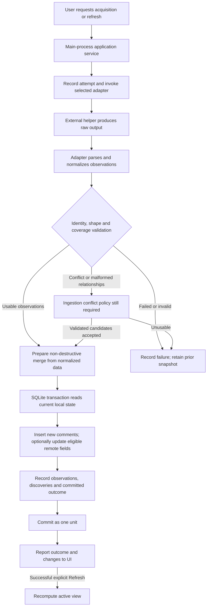

# Refresh and merge

Refresh acquires remote discussion data and merges it into the local discussion already owned by the reader. The database is an accumulating local history, not a replacement mirror of one extraction. A downloaded snapshot has less authority than the user's durable local state. Pure observations/adapters are implemented in [ADR 0003](decisions/0003-extractor-observations-and-normalization.md); no acquisition or refresh/merge service is implemented.

Read [how the application works](HOW_IT_WORKS.md) for the full journey, [extractors](EXTRACTORS.md) for adapter responsibilities, and [database design](DATABASE.md) for transaction boundaries.

## Required guarantees

- Match existing comments using stable source identities, not text, timestamps, sort order or list positions.
- Preserve the current seen state of existing comments.
- Insert newly discovered comments unseen.
- Eligible remote metadata/text may be updated when newer valid information is available; any such update must preserve local user state.
- Preserve first-discovered information; update last-observed information only for comments actually observed in an accepted refresh.
- Never delete a stored comment merely because one extraction omitted it.
- Never let failure, partial output or uncertain completeness destroy a previously valid local snapshot.
- Commit refresh-related discussion changes transactionally and retain useful refresh history.
- Record discovery separately from seen state. A new comment can immediately become seen; an old comment can remain unseen indefinitely.

These guarantees also govern the first acquisition, where there is no existing discussion snapshot to merge into. The first successful acquisition establishes a local baseline: every imported comment receives `firstDiscoveredAt` and starts unseen, but the initial acquisition must not label its imported comments visually NEW. Comments first discovered in subsequent refreshes are eligible for NEW indicators. Marker lifetime/reset behavior remains unresolved.

Valid partial/unknown observations are accepted as input, but their application outcome and first-baseline treatment remain unresolved. Do not silently decide how accepting them establishes a successful baseline or affects later NEW eligibility.

## Proposed processing path

Run the external process and parse/validate its output outside the write transaction. A helper may be slow or fail; it should not keep a database write transaction open for its whole lifetime. The exact orchestration and staging format remain implementation choices. The renderer receives typed progress/results rather than executable paths or raw SQL access.

Validated partial and unknown-completeness observations are acceptable non-destructive input; an entire discussion need not be proven complete. Neither a successful process exit nor parseable comments/count equality proves complete coverage. Adapter contracts distinguish unknown, known-partial with evidence, failed/unusable, and reserved complete with affirmative evidence. Current backends never emit complete. Conflict/orphan acceptance and baseline/history/reporting/view behavior still require design before persistence.

## Merge rules by field ownership

| Incoming observation | Merge rule |
| --- | --- |
| Stable identity matches an existing comment | Keep the same local identity and seen state; eligible remote fields may receive newer valid information |
| Stable identity has not been stored before | Insert the comment unseen; establish first discovery and its refresh association |
| Stored comment was observed again | Advance its last-observed information according to the accepted observation |
| Stored comment is absent from this result | Keep the comment and its local state; do not advance its last-observed information |
| Text or other remote metadata changes | May apply newer valid remote information without resetting seen or first discovery; mutation is not required on every refresh |
| Incoming field is missing/unknown, lossy-default or unreliable | Preserve the existing useful field; only a positively observed meaningful value (including trustworthy empty/zero/false) can authorize a remote update |
| Duplicate/conflicting identity or invalid structure | Validate and follow an explicit conflict policy; do not silently corrupt stored relationships |
| Commit fails | Roll back discussion changes, including discoveries associated with the failed commit |

The merge service must use current stored local state when it commits. Extraction can overlap a user marking a comment seen; an upsert that writes an old default `seen = false` over that row is incorrect. Prefer ownership-aware updates that cannot overwrite seen state at all for existing rows. Re-observing an unchanged comment is not a new discovery. Reapplying an accepted observation must not create duplicate comments.

An explicit remote deletion/tombstone, if an adapter can reliably provide one, is different from absence. Its treatment is unresolved. Keeping historical text, signaling edits/deletions, preserving versions and offering manual removal are also not specified requirements; do not infer them from the non-deletion invariant.

## Attempts, observations and discovery

Refresh history should make it possible to understand when a discussion was checked, what the check found, and whether it was trustworthy. A proposed attempt record includes:

- The content item and an attempt identifier.
- Start and finish times and, where useful, the relevant helper/version.
- Outcome and coverage classification, explicitly distinguishing complete, partial and unknown coverage and including useful failure or coverage diagnostics.
- Counts of observed comments, first discoveries and relevant metadata changes, with unambiguous meanings.
- A relation between committed first discoveries and the attempt that accepted them, including identification of the initial successful baseline acquisition.

The precise status vocabulary, progress format, metadata-change comparison rules, raw-output retention, and diagnostic retention are open design choices. A “success” label must not hide partial or unknown coverage, and a history record must not claim committed changes that rolled back.

An attempt may be recorded before extraction and then finalized with committed discussion changes. A failed or interrupted attempt can be recorded separately after rollback without altering the previously valid discussion snapshot. Crash recovery must distinguish an unfinished attempt from a committed successful refresh. The physical design is discussed in [database design](DATABASE.md).

Publication time (`publishedAt`) answers when the comment was posted. First-discovered time (`firstDiscoveredAt`) answers when this installation first accepted it, including initial baseline imports. Last-observed time (`lastObservedAt`) answers when it was most recently observed in an accepted refresh. These answer different questions and must not overwrite one another. Missing source publication times require a declared policy rather than a substitute timestamp.

“New since refresh” concerns discovery/refresh history. Publication-date filters separately evaluate `publishedAt`. Do not present a vague “Since last refresh” publication-date preset that conflates these meanings: a reply first discovered today can have been published months ago. The initial acquisition records first discovery without visual NEW indicators; later refresh discoveries are eligible under the eventual marker lifetime/reset policy. See [filtering and search](FILTERING_AND_SEARCH.md).

## Failure, partial output and unknown completeness

Expected failure cases include helper absence, invocation failure, interruption, network failure, unsupported/private URLs, parse failure, malformed normalized data, partial pagination and database errors. Preserve the prior valid data and user state in all cases. Present localized context around useful raw diagnostics; see [localization](LOCALIZATION_AND_THEMING.md).

The owner accepts valid partial/unknown observations as input for a later safe non-destructive merge. The field-authority and direct-parent/thread-containment rules are explicit in [ADR 0003](decisions/0003-extractor-observations-and-normalization.md). This does not implement commits or settle which conflicting candidates are eligible, baseline implications, observation timing/history schema, or partial/unknown reporting and active-view behavior. Missing comments remain completely untouched, including last-observed data. Unknown completeness remains unknown when observations are accepted. Explicit trustworthy deletion evidence would need a future separate policy.

Cancellation semantics, retries, helper timeouts, concurrent refreshes of the same content item and ordering of overlapping attempts remain unresolved. These choices must prevent older observations from accidentally overwriting a newer accepted snapshot and must preserve manual seen edits. Deterministic [tests](TESTING.md) should exercise the eventual policies.

## Reporting changes and updating the active view

After commit, the UI can report how many comments were first discovered and how many are currently unseen. Those are independent quantities. The baseline acquisition records discoveries and unseen comments without visually labeling the whole initial discussion NEW. The NEW badge/ruler-marker lifetime for subsequent discoveries is a presentation decision; the discovery facts belong in durable history.

Remote Refresh remains separate from Apply changes / Update view. Apply uses already stored data and recomputes the active filter results; it must not invoke an extractor. A successful explicit remote Refresh safely merges the remote data and then automatically recomputes the active view, producing the next applied active-filter matching set. The user does not need a separate Apply action after that success.

Seen edits alone preserve visible membership, ordering and the last applied active-filter matching set. Matching-only bulk actions continue to use that set until Apply or a successful explicit Refresh produces its replacement. Raw search matches and contextual comments do not define the target set. Failed refreshes must not masquerade as successful updates; application reporting and view handling for partial/unknown outcomes remain open despite accepted observational input. Exact scroll reconciliation, inactive-tab behavior, styling and supplementary live indicators remain design choices. See [seen state](SEEN_STATE.md) and [UI and navigation](UI_AND_NAVIGATION.md).

## Required verification and decision points

[Tests](TESTING.md) should use saved extractor fixtures and temporary databases to cover baseline imports that are unseen with first-discovery history but no visual NEW, subsequent late discovery, unchanged re-observation, eligible newer text, duplicate input, missing comments, failed extraction, partial output and unknown completeness under the selected policy, transaction rollback and an in-flight manual seen edit. Verify that successful explicit Refresh recomputes the active view and its applied matching set, while Apply invokes no extractor. A failed commit must leave neither partial comment changes nor false committed-discovery records.

Observation identity, field authority, partial/unknown input acceptance and relationship evidence are settled in ADR 0003. Before durable ingestion, resolve identity constraints/collision arbitration, orphan/malformed-tree handling, merge/history storage and partial/unknown baseline/reporting implications. Resolve concurrency/cancellation before overlapping operations. NEW lifetime, scroll reconciliation and explicit tombstones remain separate future decisions; they do not reopen baseline or successful-Refresh requirements. Record significant choices in [decision records](decisions/README.md).
