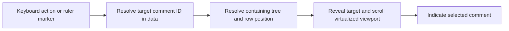

# UI and navigation

This document describes the intended desktop reader. The first application milestone demonstrates two pre-opened synthetic discussion tabs, item headers, nested replies, optional metadata, publication times, manual checkboxes, and separate UNSEEN/NEW examples. Counts cover all comments in each demo discussion. Panels retain session scroll positions; seen state is shared in memory and changes only by checkbox actions. There is no saved workspace, tab opening/closing, search/filtering, real refresh, virtualization, or ruler yet. Fixed NEW examples do not settle marker lifetime. See [ADR 0001](decisions/0001-synthetic-reader-foundation.md). Read the [product requirements](PRODUCT_REQUIREMENTS.md) for scope, [how it works](HOW_IT_WORKS.md) for the complete flow, and [filtering and search](FILTERING_AND_SEARCH.md) for what a displayed result means.

Windows is the initial target platform. Other platform support is a later possibility; see [packaging](PACKAGING.md).

## Organize reading around discussions

Use browser-like tabs for opened YouTube videos and individual Community Posts. The principal loop is **acquire → persist → refresh → identify what changed → read in context → manually mark processed → search/filter/navigate**. This is a persistent discussion inbox, so reopening the application must restore useful reading state instead of discarding it like a temporary download.

Each tab independently remembers at least the following kinds of state:

| State | Purpose |
| --- | --- |
| Content item | Identify the video or Community Post being read. |
| Scroll position | Resume reading near the previous position. |
| Active filters and search | Preserve the user's current reading task. |
| Sorting | Preserve the organization of top-level conversations. |
| Expanded/collapsed replies | Preserve how much of each conversation is revealed. |
| Selected/navigation comment | Restore the current location for keyboard reading. |

Tabs and useful view state survive restart through the application's durable storage, not localStorage. Seen state belongs to comments in the shared database, not to a tab. Two tabs referring to the same comment must not create two independent seen states. The policy for opening duplicate tabs is unresolved.

Saving a stable comment anchor with an offset is a candidate for resilient scroll restoration when row heights or data change; the exact storage format and fallback when an anchor is unavailable are undecided. Persisting all ephemeral query result IDs across restart is not required by the current specification. The policy for restoring a view that had pending recomputation must be decided. See [database](DATABASE.md) and [seen state](SEEN_STATE.md).

A tab may show an unseen-comment count. If provided, define whether it counts the entire content item or a filter scope, and keep its label clear. This is a derived count of individual comments, not a stored thread-level status. Count scope and interaction with a stable displayed result remain open.

## The comment reader

The discussion should resemble YouTube's familiar comment/reply structure while supporting desktop reading. Keep replies visually attached to their conversations. Sorting primarily reorders top-level threads; it must not scatter replies into unrelated positions.

The design should accommodate an avatar, author/display name/handle, comment text, relative publication time, exact timestamp on hover or in details, like count, pinned status, uploader/creator indication, nested replies, a seen checkbox, and permalink/copy actions. Some source fields may be absent. Their absence must not be displayed as a fabricated value, and the initial exact field layout remains a UI decision.

Rendering external content must respect the [Electron security boundary](ARCHITECTURE.md). Do not treat comment text or extractor output as trusted application markup. Avatar loading/caching, external-link opening, and supported text formatting need explicit policies before implementation.

Relative times and numbers use the chosen display locale; exact timestamps must remain discoverable. [Localization and theming](LOCALIZATION_AND_THEMING.md) describes live language/theme changes and semantic visual tokens.

### Manual processing controls

Clicking a comment's checkbox toggles only that comment. Ctrl+click applies the resulting state to that comment and every descendant in its stored subtree. It does not toggle descendants independently, touch ancestors, or limit the operation to rows currently rendered by the virtualizer. No scroll, display, navigation, expansion, or selection action marks a comment seen.

The user-specified Ctrl+click gesture must be supported. Platform-specific alternative gestures, keyboard equivalents, and control discoverability are not yet specified. They should preserve the same [seen-state semantics](SEEN_STATE.md).

Bulk controls must support all comments, before/after/between publication timestamps, and actual matching filter results, scoped to the active discussion. “All comments” means every stored comment for the active video or Community Post. Date operations affect each qualifying comment independently, while matching-only operations use the last applied active-filter matching IDs and exclude visible context. Undo/recoverability is a design requirement; its mechanism is unresolved.

### Context, matches, discovery, and state

Keep these concepts visually understandable:

| Concept | Source of truth |
| --- | --- |
| Seen/unseen | Persisted manual state of this comment. |
| Raw search match | The comment satisfies the search expression, independently of other filters. |
| Active-filter match | The comment satisfies the full combined predicate in the last applied evaluation. |
| Context-only | Included for its conversation without being an active-filter match; it may still contain a raw search hit. |
| Newly discovered | Discovery associated with a refresh, independently of seen state. |

While seen edits await view recomputation, the displayed membership and order remain stable. The logical active-filter matching set, match/context roles, and matching-comment/containing-thread counts stay tied to the last applied evaluation. Live checkboxes reflect saved state. Exact styling, pending wording, and supplementary live indicators remain design choices, but must not replace the applied set/count with a fresh query. Matching-only bulk actions and next/previous match navigation use that applied matching set; see [stable filtering](FILTERING_AND_SEARCH.md).

An old comment can remain unseen for months; a just-discovered comment can immediately be marked seen. “New” must not become a synonym for “unseen.” The first successful acquisition establishes the baseline: its comments are unseen and retain `firstDiscoveredAt`, but receive no visual **New** highlighting. Comments discovered by later refreshes are eligible for new indicators. The lifetime and presentation window of those later indicators remain unresolved; [refresh and merge](REFRESH_AND_MERGE.md) defines the underlying distinction.

All locally stored comments in a matching top-level conversation are part of the contextual result. Collapsing replies may hide rows from immediate display, but must not erase their membership, counts, or navigation targets. How the UI indicates matches within a collapsed subtree is an open presentation decision.

## Separate updating a view from refreshing a source

Manual seen changes save immediately. They must not cause the current result membership or order to rearrange beneath the reader. **Apply changes / Update view** recomputes that result using saved data. **Refresh** retrieves remote data and merges it into persistence; after a successful explicit Refresh, the active view is automatically recomputed without another Apply action. These operations need distinct controls and explanations.

| Action | Meaning | Shortcut status |
| --- | --- | --- |
| Apply changes / Update view | Recompute local results after persisted changes. | Ctrl+Enter is likely, pending the formal keyboard policy. |
| Refresh source | Run the relevant extractor, merge observations, and automatically recompute the active view on success. | F5 is likely, pending the formal keyboard policy. |
| Next/previous unseen | Navigate between unseen targets within the applicable filtered view. | Bindings undecided. |
| Next/previous match | Navigate between the current applied active-filter matches. | Bindings undecided. |

The final labels and shortcuts require a later UI decision. A pending-view indicator is a proposed aid; it must make clear that seen changes are already saved. Filter-control apply timing, supplementary live indicators, and updates to unseen-navigation targets while a view is pending remain unresolved. The applied matching set/count and matching-only bulk scope are settled as described above. See [stable filtering](FILTERING_AND_SEARCH.md).

Extraction can be long-running or fail. Provide understandable progress, error, and partial-result context without confusing a failure with an empty discussion or losing the last valid local snapshot. Exact progress and cancellation controls are not specified yet; [extractors](EXTRACTORS.md) and [refresh and merge](REFRESH_AND_MERGE.md) own their underlying contracts.

## Navigate data, then reveal the row

Keyboard navigation must support next/previous unseen comments and matches. Next/previous navigation in the filtered reader uses the current applied active-filter matching set. Any separately labeled search-specific navigation must operate within the applicable view and must not confuse raw search hits with active-filter matches. Targets are comment identities in application data, not a query for rendered DOM elements. This lets navigation reach a comment many thousands of rows away or inside a collapsed subtree.

The implementation must be able to identify a target, make its location visible, scroll it into the virtualized viewport, and indicate the active comment. This may require expanding its ancestor path. Whether such expansion is temporary or persisted, whether navigation wraps, and how live seen edits update specialized unseen targets within the applicable view remain unresolved. These choices must not broaden the filtered reader's match navigation beyond its applied matching set.

Navigating to a comment must never change its seen state. Selecting a match must also not cause context comments to join the matching set.

## Overview ruler

Provide a VS-Code-like overview ruler alongside the comment scrollbar as a required feature, with markers for unseen comments, search matches, and newly discovered comments. Clicking a marker navigates to the corresponding comment. Initial-baseline comments receive no **New** markers. This provides navigation across the data without relying on browser Ctrl+F behavior.

Markers must be computed from application data even when their comments are off-screen. Their position mapping must remain meaningful with variable-height rows, collapsed replies, and sorted conversations. The final mapping, overlapping-marker handling, marker aggregation/density, and category priority are unresolved. A visual mockup must not silently settle these data semantics.

Use semantic theme tokens for marker categories and distinguish important states with more than color alone. Ensure keyboard navigation offers access to the same comment targets. See [localization and theming](LOCALIZATION_AND_THEMING.md).

## Large discussions and durable state

Assume thousands or tens of thousands of comments. Virtualize the large comment view while keeping the complete result model available to filtering, counts, bulk actions, and navigation. Do not render the entire dataset merely to enable search or overview-ruler positioning.

Virtualization library, measurement strategy, overscan, query scheduling, IPC pagination/batching, and performance budgets remain engineering choices. Stable comment identities must connect storage, rows, selection, and restoration; row indexes alone are not durable identities. Review the [architecture](ARCHITECTURE.md) before choosing library-specific view state.

A small meaningful UI/E2E suite is expected later. Choose a few workflows that cross important boundaries, such as baseline acquisition followed by refresh, saved seen edits followed by a matching bulk action and Apply, or navigation through a virtualized discussion and restored tabs. These are candidates, not an exhaustive UI-test checklist. Keep most state, search, scope, and discovery edge cases in the fast domain/integration suites described in [testing](TESTING.md), with focused UI checks for the ruler, languages, and themes where useful.
