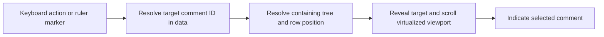

# UI and navigation

The reader implements nested comments, explicit manual seen checkboxes, English/Polish preferences, live acquisition/Refresh and the compact persistent tab workspace in [ADR 0007](decisions/0007-unified-workspace-and-library-removal.md). Library, open tab order and active selection are distinct; close never deletes a discussion. Panels retain scroll only while mounted in the session; persisted scroll and full view restoration remain targets. Active-discussion search/seen filtering, stable session applied views and match/unseen navigation are implemented in [ADR 0008](decisions/0008-active-discussion-applied-queries.md). Date/discovery filtering, bulk actions, virtualization and the ruler remain targets. Counts cover all stored comments of the discussion; synthetic fixed NEW examples do not settle marker lifetime. See [requirements](PRODUCT_REQUIREMENTS.md), [the walkthrough](HOW_IT_WORKS.md) and [filtering semantics](FILTERING_AND_SEARCH.md).

Windows is the initial target platform. Other platform support is a later possibility; see [packaging](PACKAGING.md).

## Keyboard shortcuts and discoverability

Current bindings target Windows; future platform mappings may differ. The renderer
owns one metadata registry (`src/renderer/shortcuts.ts`) with stable IDs, key tokens,
localized descriptions, categories and contextual scopes. Its formatter supplies
Settings key labels and control hints. Handler callbacks remain with the relevant
view; no configurable bindings or shortcut preferences are stored.

Settings contains the complete localized Keyboard shortcuts reference, including
existing focused-tab navigation, seen gestures, form submission and cancellation.
Apply, match navigation, discussion search, Library filter, Add/Open, active tab
close, seen help and tab reorder help expose compact registry-derived hints.
Background close controls omit Ctrl+W because that command closes the active tab.

| Binding | Implemented action and scope |
| --- | --- |
| Ctrl+Tab / Ctrl+Shift+Tab | Activate next/previous workspace tab, wrapping across discussion, Library and Settings tabs. |
| Ctrl+W | Close active tab using the existing right-then-left neighbor rule; empty workspace does nothing. Stored discussions are retained. |
| Ctrl+F | Focus/select the active discussion search or Library metadata filter. Settings and empty workspace leave browser/default behavior alone. |
| Ctrl+L | Reveal the existing URL form and focus/select its input; repeat selects existing text. Subsequent typing/navigation remains ordinary input editing. |
| F1 | Open/activate singleton Settings and scroll/focus the stable `keyboard-shortcuts` heading after acknowledged activation and committed rendering, including when Settings is already active. |
| Ctrl+Enter | Apply active discussion draft, including from its query controls. |
| F3 / Shift+F3 | Next/previous applied match, including from query controls; never save seen state. |
| Alt+Left / Alt+Right | Reorder only the focused workspace tab. |
| Left / Right / Home / End | Existing activation/focus navigation on workspace tabs. |
| Ctrl+Click | Seen checkbox applies its resulting state to the comment and all descendants. |
| Enter | Existing natural URL submission or discussion query form Apply. |
| Escape | Existing drag cancellation, URL form hiding and removal dialog cancellation unless removal is pending. |

One Reader document routing boundary handles workspace/focus/help and discussion
commands. Focused-tab keys, native form submission and contextual cancellation
stay with their existing owners. Exact modifiers, composition and already-handled
events are respected. Inputs, textareas, selects and contenteditable keep ordinary
typing/navigation. Explicit exceptions are workspace cycling/close, search focus,
URL focus and F1; discussion Apply/match keys also work in query controls but do
not interrupt unrelated editable controls such as the URL form.

Removal confirmation suspends every top-level shortcut while open, including
while its write is pending. The native modal retains keyboard/focus ownership;
Escape still follows its existing safe cancellation rule. Pending workspace writes
do not launch another workspace command. Defaults are prevented only after a
contextual command is accepted; missing focus targets and inapplicable commands
remain unconsumed. No global Alt+arrow reorder is introduced.

Source Refresh remains button-only: no Ctrl+R/F5 source-refresh binding. Reopen
(Ctrl+Shift+T), numbered tabs (Ctrl+1..9), global comment search and unseen
navigation shortcuts are deliberately unbound. No new query semantics, persistent
view state, OS hotkeys or platform policy is introduced by this UX increment.

## Implemented acquisition controls

[ADR 0007](decisions/0007-unified-workspace-and-library-removal.md) implements one
ordered workspace of singleton discussion, Library and Settings tabs. Every kind
can close, move and become active. App launch actions activate an existing view
or append a closed one. None is pinned or reserves a slot. Inline SVG icons,
truncated titles and separate close buttons keep horizontal tabs compact;
accessible names/tooltips announce Video, Community Post, Library and Settings.

Pointer dragging previews order with feedback and commits only its final slot.
Alt+Left/Right on a focused tab reorders it without changing active identity;
Arrow/Home/End activate/focus. Closing active chooses immediately right, otherwise
left, otherwise empty. Closing background preserves active. Open/active/order
persist in schema 4; acquisition opens its singleton discussion and Refresh does
not alter workspace. Revision checks preserve newer local workspace acknowledgments.

Library is a full workspace view of all stored discussions, including closed ones,
with author/handle, comment/unseen counts and open status. Open reuses stored
identity/state; Activate does not duplicate a tab. The simple metadata filter
covers video title, post text, author display name and handle, independent of UI
language. It is not discussion comment search. Remove from Library opens a modal
confirmation describing permanent local comment/seen/history deletion and no
effect on YouTube. Cancel is initially focused; Escape cancels unless a write is
pending. Success updates Library and removes the discussion's view with ordinary
neighbor rules; failure retains the item. Synthetic demo removal is unavailable
with an explanation. Main rejects removal while that source is being acquired/
refreshed; wait and retry. No undo or remote delete is implemented.

Settings is a normal singleton tab containing durable Language and Appearance.
The compact toolbar has branding, Add/Open, Library and Settings; preference
dropdowns no longer occupy it. Helper configuration explanation contains no
configured paths or editing UI. The on-demand URL form and compact source/coverage
header remain. Video descriptions retain full text behind two-line Show/Hide;
Community bodies remain readable.

The comment tree keeps the safe projected relationships. Neutral ancestry rails
continue through parent gutters and sibling branches; short elbows and last-child
termination expose the nested structure. Nested lists retain depth semantics at
all levels; reply indent is 22px, then 10px from depth 5 and 3px from depth 10. From depth 5 a neutral return connector joins the parent gutter to its compact rail.
Unseen uses a subtle row tint plus UNSEEN text and the explicit checkbox. Rails
never indicate seen state. Compact 32px avatars, bylines and multiline bodies stay.

No persisted scroll, filters, sorting, expansion, selected comment or complete
workspace restoration is claimed. Query criteria, applied results and selection are independent per-discussion session state, retained on close/reopen and cleared on Library removal. Dates, bulk actions, virtualization, collapse and overview ruler remain targets.

Avatars use only usable HTTPS URLs, anonymous CORS, no-referrer, lazy loading,
async decoding and fixed dimensions. Empty alt text avoids duplicating the byline;
load/CORS failure falls back to initials. There is no image cache or authenticated
loading, and source text never becomes HTML/SVG markup.

The compact URL form accepts supported public video/individual-post URLs; Enter
and Add / Open submit. Main validates/canonicalizes the target. Successful
acquisition merges known sources instead of opening duplicate items and activates
the acknowledged item. Real items have Refresh; demo items do not. Refresh uses
stored source identity and retains the current tab selection. Last applied criteria are reevaluated against committed comments, including those missing from the newest extraction and new unseen ones. Draft controls are preserved; reevaluation failure keeps prior valid membership and reports a view error.

Acquiring/Refreshing status disables live submission only; reading, tabs and local
seen/preference saves remain available. Failure shows localized stable error
context and preserves the current discussion. Accepted partial/unknown output
shows a modest coverage notice. English and Polish cover every new label/error.
Real items use local-library wording and current render time; fixed demo-clock
and NEW examples are confined to synthetic items. NEW lifetime stays unresolved.
Renderer acknowledgment reconciliation preserves local seen edits across overlapping
save/acquisition responses without overwriting newly merged membership/remote text.

## Organize reading around discussions

Use browser-like tabs for opened YouTube videos, individual Community Posts, Library and Settings. The principal loop is **acquire → persist → refresh → identify what changed → read in context → manually mark processed → search/filter/navigate**. This is a persistent discussion inbox, so reopening the application must restore useful reading state instead of discarding it like a temporary download.

Beyond the implemented item IDs/order/active selection, the target for later
independent per-tab view restoration includes the following state:

| State | Purpose |
| --- | --- |
| Content item | Identify the video or Community Post being read. |
| Scroll position | Resume reading near the previous position. |
| Active filters and search | Preserve the user's current reading task. |
| Sorting | Preserve the organization of top-level conversations. |
| Expanded/collapsed replies | Preserve how much of each conversation is revealed. |
| Selected/navigation comment | Restore the current location for keyboard reading. |

Open item IDs, tab order and active ID now survive restart through SQLite. The additional useful view state in the table above remains a target. Seen belongs to shared comments, not tabs. Opening an already open item activates its single existing tab; reopening a closed item reuses its stored identity/state.

Saving a stable comment anchor with an offset is a candidate for resilient scroll restoration when row heights or data change; the exact storage format and fallback when an anchor is unavailable are undecided. Persisting all ephemeral query result IDs across restart is not required by the current specification. The policy for restoring a view that had pending recomputation must be decided. See [database](DATABASE.md) and [seen state](SEEN_STATE.md).

A tab may show an unseen-comment count. If provided, define whether it counts the entire content item or a filter scope, and keep its label clear. This is a derived count of individual comments, not a stored thread-level status. Count scope and interaction with a stable displayed result remain open.

## The comment reader

The discussion uses Reddit-like neutral ancestry rails and elbows while supporting desktop reading. Keep replies visually attached to their conversations. Sorting primarily reorders top-level threads; it must not scatter replies into unrelated positions.

The design should accommodate an avatar, author/display name/handle, comment text, relative publication time, exact timestamp on hover or in details, like count, pinned status, uploader/creator indication, nested replies, a seen checkbox, and permalink/copy actions. Some source fields may be absent. Their absence must not be displayed as a fabricated value, and the initial exact field layout remains a UI decision.

Rendering external content respects the [Electron security boundary](ARCHITECTURE.md). Remote text remains React text. ADR 0006 selects anonymous HTTPS avatars with fallback and no application cache; external-link opening and richer formatting remain open.

Relative times and numbers use the chosen display locale; exact timestamps must remain discoverable. [Localization and theming](LOCALIZATION_AND_THEMING.md) describes live language/theme changes and semantic visual tokens.

### Manual processing controls

Clicking a comment's checkbox toggles only that comment. Ctrl+click applies the resulting state to that comment and every descendant in its stored subtree. It does not toggle descendants independently, touch ancestors, or limit the operation to rows currently rendered by the virtualizer. No scroll, display, navigation, expansion, or selection action marks a comment seen.

The user-specified Ctrl+click gesture is exposed through seen-control help and the
Settings shortcut reference. Platform-specific alternative gestures and keyboard
equivalents remain unspecified; they must preserve the same [seen-state semantics](SEEN_STATE.md).

Bulk controls must support all comments, before/after/between publication timestamps, and actual matching filter results, scoped to the active discussion. “All comments” means every stored comment for the active video or Community Post. Date operations affect each qualifying comment independently, while matching-only operations use the last applied active-filter matching IDs and exclude visible context. Undo/recoverability is a design requirement; its mechanism is unresolved.

### Context, matches, discovery, and state

Keep these concepts visually understandable:

| Concept | Source of truth |
| --- | --- |
| Seen/unseen | Persisted manual state of this comment. |
| Raw search match | The comment satisfies the search expression, independently of other filters. |
| Active-filter match | The comment satisfies the full combined predicate in the last applied evaluation. |
| Context-only | Included for its conversation without being an active-filter match; it may still contain a raw search hit. |
| Newly discovered | Discovery associated with a refresh, independently of seen state. |

While seen edits await view recomputation, the displayed membership and order remain stable. The logical active-filter matching set, match/context roles, and matching-comment/containing-thread counts stay tied to the last applied evaluation. Live checkboxes reflect saved state. MATCH/CONTEXT badges identify applied roles, with SEARCH HIT for raw-only context. They are independent of live unseen tint/checkbox, NEW and neutral rails. Saved seen changes show an Apply indication only for applied Seen/Unseen; draft difference is separate. Neither changes applied counts. Matching-only bulk actions and next/previous match navigation use that applied matching set; see [stable filtering](FILTERING_AND_SEARCH.md).

An old comment can remain unseen for months; a just-discovered comment can immediately be marked seen. “New” must not become a synonym for “unseen.” The first successful acquisition establishes the baseline: its comments are unseen and retain `firstDiscoveredAt`, but receive no visual **New** highlighting. Comments discovered by later refreshes are eligible for new indicators. The lifetime and presentation window of those later indicators remain unresolved; [refresh and merge](REFRESH_AND_MERGE.md) defines the underlying distinction.

All locally stored comments in a matching top-level conversation are part of the contextual result. Collapsing replies may hide rows from immediate display, but must not erase their membership, counts, or navigation targets. How the UI indicates matches within a collapsed subtree is an open presentation decision.

## Separate updating a view from refreshing a source

Manual seen changes save immediately. They must not cause the current result membership or order to rearrange beneath the reader. **Apply changes / Update view** recomputes that result using saved data. **Refresh** retrieves remote data and merges it into persistence; after a successful explicit Refresh, the active view is automatically recomputed without another Apply action. These operations need distinct controls and explanations.

| Action | Meaning | Shortcut status |
| --- | --- | --- |
| Apply | Validate/evaluate draft over acknowledged local data; only success promotes it. | Ctrl+Enter while a discussion is active; Enter in its search form. |
| Refresh source | Run the relevant extractor, merge observations, and automatically recompute the active view on success. | Button only; Ctrl+R/F5 source Refresh deliberately unbound. |
| Next/previous unseen | Live unseen comments in displayed applied trees, including context. | Accessible buttons; no keyboard binding added. |
| Next/previous match | Last applied active-filter matching IDs in displayed preorder. | F3 / Shift+F3 and accessible buttons. |

The compact search form edits draft only: text, selected fields, All/Unseen/Seen, case and regex toggles, and Apply. It does not apply on typing. Invalid/expensive/failed evaluation retains previous results and shows localized feedback. Navigation wraps, never marks seen, and unseen targets update from live seen independently of applied matches. Refresh shortcuts and collapse/virtualized reveal policies remain open. The applied matching set/count and matching-only bulk scope are settled as described above. See [stable filtering](FILTERING_AND_SEARCH.md).

Extraction can be long-running or fail. Provide understandable progress, error, and partial-result context without confusing a failure with an empty discussion or losing the last valid local snapshot. Exact progress and cancellation controls are not specified yet; [extractors](EXTRACTORS.md) and [refresh and merge](REFRESH_AND_MERGE.md) own their underlying contracts.

## Navigate data, then reveal the row

[ADR 0009](decisions/0009-isolated-discussion-rendering-and-tab-input.md) keeps
discussion content mounted while isolating rendering from activation. The stable
strip owns pointer capture: movement into the reader and back continues dragging.
Release commits once; Escape, pointer/lifecycle cancellation or actual strip
capture loss cancels. Capture outside the native window depends on OS/browser
behavior. Vertical wheel over an overflowing strip scrolls horizontally
immediately; horizontal deltas also work. Motion at an immovable edge or without
overflow is not consumed. Wheel outside the strip retains normal panel scrolling.

Keyboard navigation must support next/previous unseen comments and matches. Next/previous navigation in the filtered reader uses the current applied active-filter matching set. Any separately labeled search-specific navigation must operate within the applicable view and must not confuse raw search hits with active-filter matches. Targets are comment identities in application data, not a query for rendered DOM elements. This lets navigation reach a comment many thousands of rows away or inside a collapsed subtree.

The implementation must be able to identify a target, make its location visible, scroll it into the virtualized viewport, and indicate the active comment. This may require expanding its ancestor path. Current uncollapsed navigation wraps at both ends. Match candidates remain applied IDs; unseen candidates use live seen over displayed membership. From context, next/previous selects the eligible neighbor in preorder. Each row has an application-owned target ID, selection outline and final scrollIntoView call. Collapse/virtualization expansion and restoration policies remain open. These choices must not broaden the filtered reader's match navigation beyond its applied matching set.

Navigating to a comment must never change its seen state. Selecting a match must also not cause context comments to join the matching set.

## Overview ruler

Provide a VS-Code-like overview ruler alongside the comment scrollbar as a required feature, with markers for unseen comments, search matches, and newly discovered comments. Clicking a marker navigates to the corresponding comment. Initial-baseline comments receive no **New** markers. This provides navigation across the data without relying on browser Ctrl+F behavior.

Markers must be computed from application data even when their comments are off-screen. Their position mapping must remain meaningful with variable-height rows, collapsed replies, and sorted conversations. The final mapping, overlapping-marker handling, marker aggregation/density, and category priority are unresolved. A visual mockup must not silently settle these data semantics.

Use semantic theme tokens for marker categories and distinguish important states with more than color alone. Ensure keyboard navigation offers access to the same comment targets. See [localization and theming](LOCALIZATION_AND_THEMING.md).

## Large discussions and durable state

Assume thousands or tens of thousands of comments. Virtualize the large comment view while keeping the complete result model available to filtering, counts, bulk actions, and navigation. Do not render the entire dataset merely to enable search or overview-ruler positioning.

Virtualization library, measurement strategy, overscan, query scheduling, IPC pagination/batching, and performance budgets remain engineering choices. Stable comment identities must connect storage, rows, selection, and restoration; row indexes alone are not durable identities. Review the [architecture](ARCHITECTURE.md) before choosing library-specific view state.

A small meaningful UI/E2E suite is expected later. Choose a few workflows that cross important boundaries, such as baseline acquisition followed by refresh, saved seen edits followed by a matching bulk action and Apply, or navigation through a virtualized discussion and restored tabs. These are candidates, not an exhaustive UI-test checklist. Keep most state, search, scope, and discovery edge cases in the fast domain/integration suites described in [testing](TESTING.md), with focused UI checks for the ruler, languages, and themes where useful.
